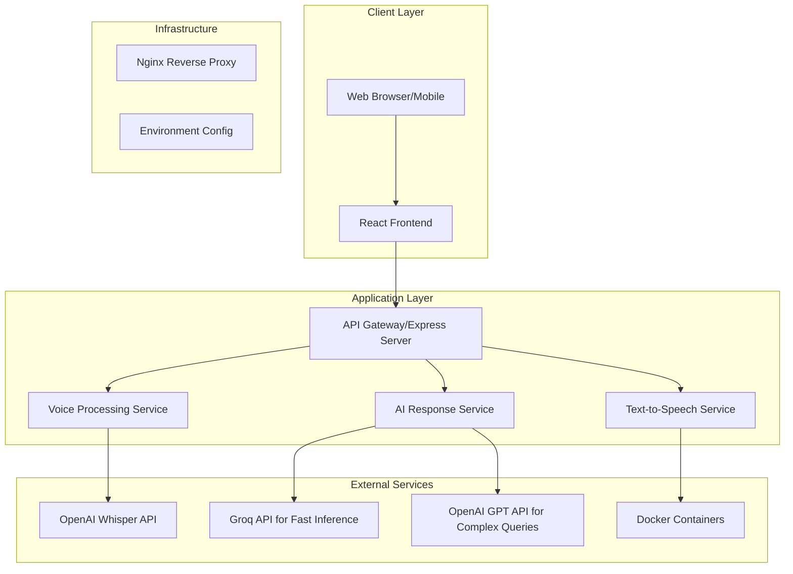

# Design Document

## Overview

Ellie is a voice-enabled AI legal assistant built as a modern web application with real-time voice interaction capabilities. The system uses a microservices architecture with separate frontend and backend services, containerized with Docker for consistent deployment. The application processes voice input through a speech-to-text pipeline, generates AI responses, and converts them back to speech for a natural conversational experience.

## Architecture

### High-Level Architecture



### Technology Stack

**Frontend:**

- React 18 with TypeScript for type safety
- Tailwind CSS for responsive design
- Web Audio API for voice recording
- Socket.io client for real-time communication
- PWA capabilities for mobile app experience

**Backend:**

- Node.js with Express.js framework
- Socket.io for real-time WebSocket connections
- Multer for audio file handling
- OpenAI Whisper API for speech-to-text
- OpenAI TTS API for text-to-speech
- Groq API for fast AI inference
- OpenAI GPT API for complex legal queries
- CORS and security middleware

**Infrastructure:**

- Docker and Docker Compose for containerization
- Nginx for reverse proxy and static file serving
- Environment-based configuration management
- Health check endpoints for monitoring

## Components and Interfaces

### Frontend Components

#### VoiceInterface Component

- Handles microphone access and audio recording
- Manages recording state (idle, listening, processing, speaking)
- Provides visual feedback with animated microphone button
- Implements error handling for permission denials

#### LandingPage Component

- Professional layout showcasing Ellie's capabilities
- Hero section with clear call-to-action
- Features section highlighting AI legal assistance
- Responsive design for all device sizes

#### ChatInterface Component

- Displays conversation history with text and audio
- Shows typing indicators during AI processing
- Provides accessibility features (text alternatives)
- Handles conversation state management

### Backend Services

#### Voice Processing Service

```typescript
interface VoiceProcessingService {
  processAudioInput(audioBuffer: Buffer): Promise<string>;
  convertTextToSpeech(text: string): Promise<Buffer>;
  validateAudioFormat(file: Express.Multer.File): boolean;
}
```

#### AI Response Service

```typescript
interface AIResponseService {
  generateResponse(
    userInput: string,
    context: ConversationContext
  ): Promise<string>;
  routeToOptimalAPI(
    query: string,
    complexity: QueryComplexity
  ): "groq" | "openai";
  processWithGroq(
    userInput: string,
    context: ConversationContext
  ): Promise<string>;
  processWithOpenAI(
    userInput: string,
    context: ConversationContext
  ): Promise<string>;
  validateLegalCompliance(response: string): Promise<boolean>;
  handleFallbackResponses(error: Error): string;
}

enum QueryComplexity {
  SIMPLE = "simple", // Basic greetings, simple questions - use Groq for speed
  MODERATE = "moderate", // General legal information - use Groq
  COMPLEX = "complex", // Complex legal scenarios - use OpenAI for accuracy
}
```

#### WebSocket Handler

```typescript
interface WebSocketHandler {
  handleVoiceMessage(socket: Socket, audioData: Buffer): Promise<void>;
  broadcastResponse(socket: Socket, response: AudioResponse): void;
  manageConnectionState(socket: Socket): void;
}
```

### API Endpoints

```
POST /api/voice/process
- Accepts audio file upload
- Returns transcribed text and AI response
- Content-Type: multipart/form-data

GET /api/voice/synthesize/:text
- Converts text to speech
- Returns audio buffer
- Content-Type: audio/mpeg

WebSocket /socket.io
- Real-time voice communication
- Events: voice-input, ai-response, error, status
```

## Data Models

### Conversation Context

```typescript
interface ConversationContext {
  sessionId: string;
  userId?: string;
  conversationHistory: Message[];
  userPreferences: UserPreferences;
  legalDisclaimer: boolean;
}

interface Message {
  id: string;
  timestamp: Date;
  type: "user" | "assistant";
  content: string;
  audioUrl?: string;
  metadata: MessageMetadata;
}

interface UserPreferences {
  voiceSpeed: number;
  language: string;
  accessibilityMode: boolean;
}
```

### Voice Processing Models

```typescript
interface AudioInput {
  buffer: Buffer;
  format: string;
  duration: number;
  sampleRate: number;
}

interface AudioResponse {
  text: string;
  audioBuffer: Buffer;
  confidence: number;
  processingTime: number;
}
```

## Error Handling

### Frontend Error Handling

- Microphone permission denied: Show clear instructions for enabling
- Network connectivity issues: Implement retry logic with exponential backoff
- Audio processing failures: Provide text-based fallback interface
- Browser compatibility: Graceful degradation for unsupported features

### Backend Error Handling

- API rate limiting: Implement queue system with user feedback
- External service failures: Fallback to cached responses or error messages
- Audio processing errors: Return structured error responses with recovery suggestions
- Validation errors: Clear error messages with specific field information

### Error Response Format

```typescript
interface ErrorResponse {
  error: {
    code: string;
    message: string;
    details?: any;
    timestamp: Date;
    requestId: string;
  };
}
```

## Testing Strategy

### Unit Testing

- Frontend: Jest and React Testing Library for component testing
- Backend: Jest for service layer and API endpoint testing
- Voice processing: Mock external APIs with test audio samples
- Error scenarios: Comprehensive error condition testing

### Integration Testing

- End-to-end voice workflow testing
- WebSocket connection and message handling
- External API integration testing
- Docker container integration testing

### Performance Testing

- Audio processing latency measurement
- Concurrent user load testing
- Memory usage monitoring during voice processing
- Network bandwidth optimization testing

### Accessibility Testing

- Screen reader compatibility
- Keyboard navigation support
- Voice interaction alternatives
- Mobile device testing across different screen sizes

## Security Considerations

### Data Privacy

- Audio data is processed in memory and not stored permanently
- Session data expires after inactivity
- No personal information stored without explicit consent
- GDPR compliance for EU users

### API Security

- Rate limiting to prevent abuse
- Input validation for all audio uploads
- CORS configuration for allowed origins
- Environment variable protection for API keys

### Legal Compliance

- Clear disclaimers about AI limitations
- No specific legal advice provision
- Professional referral mechanisms
- Conversation logging controls

## Deployment Architecture

### Docker Configuration

```yaml
# docker-compose.yml structure
services:
  frontend:
    build: ./frontend
    ports: ["3000:3000"]
    environment: [REACT_APP_API_URL]

  backend:
    build: ./backend
    ports: ["5000:5000"]
    environment: [OPENAI_API_KEY, NODE_ENV]

  nginx:
    image: nginx:alpine
    ports: ["80:80"]
    volumes: [./nginx.conf:/etc/nginx/nginx.conf]
```

### API Integration Strategy

**Groq API Usage:**

- Fast inference for simple greetings and basic questions
- General legal information queries
- Real-time conversation flow maintenance
- Cost-effective for high-frequency interactions

**OpenAI API Usage:**

- Complex legal scenario analysis
- Nuanced legal guidance requiring higher accuracy
- Fallback when Groq API is unavailable
- Speech-to-text via Whisper API
- Text-to-speech via TTS API

### Environment Configuration

- Development: Local Docker with hot reloading
- Production: VPS deployment with SSL certificates
- Environment variables for API keys (OPENAI_API_KEY, GROQ_API_KEY)
- Health check endpoints for monitoring

### Scalability Considerations

- Horizontal scaling capability for backend services
- CDN integration for static assets
- Database integration for conversation persistence (future)
- Load balancing for multiple backend instances
