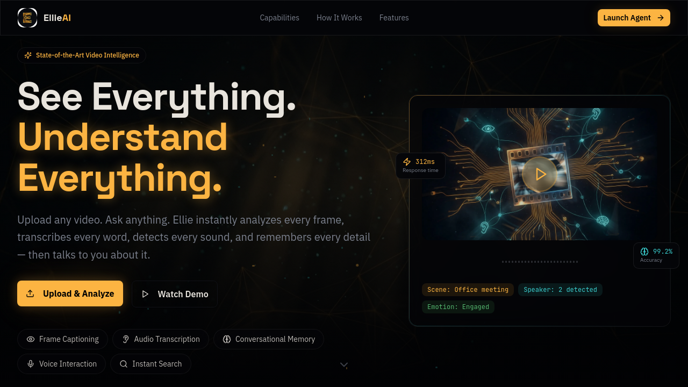
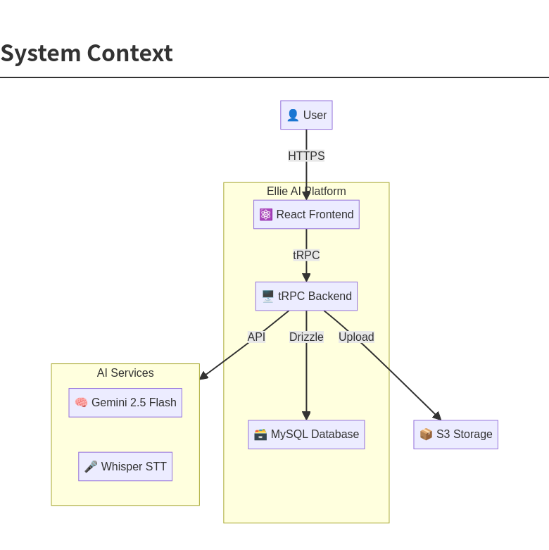
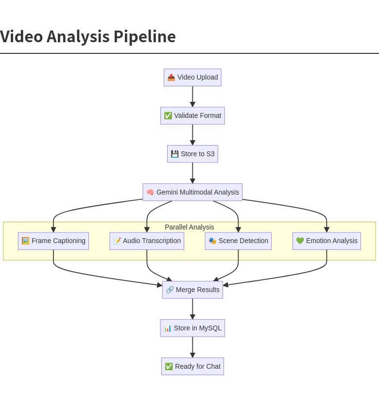
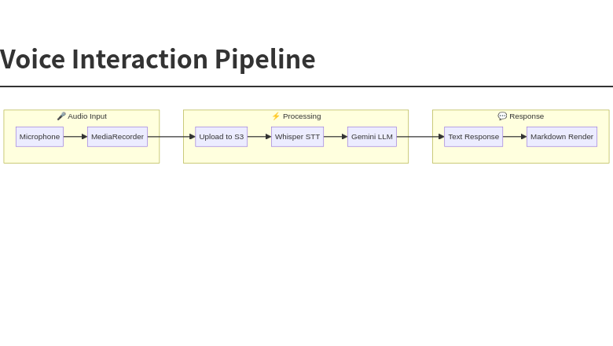
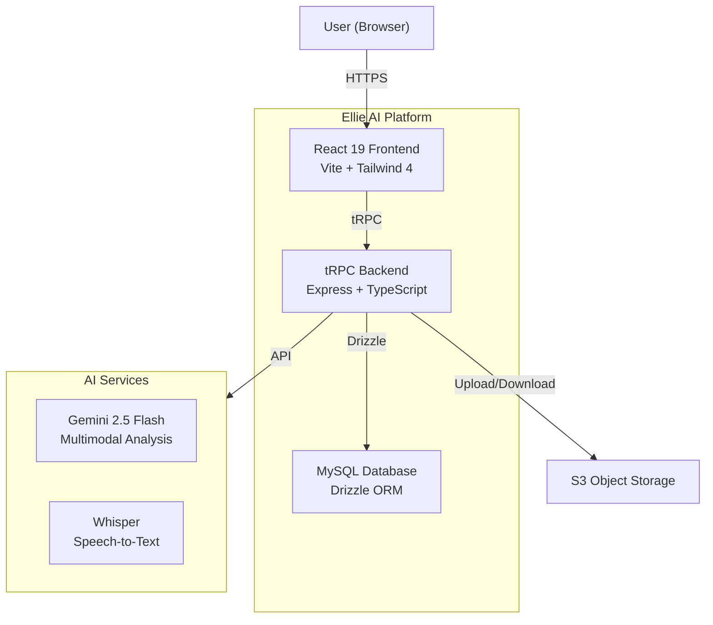
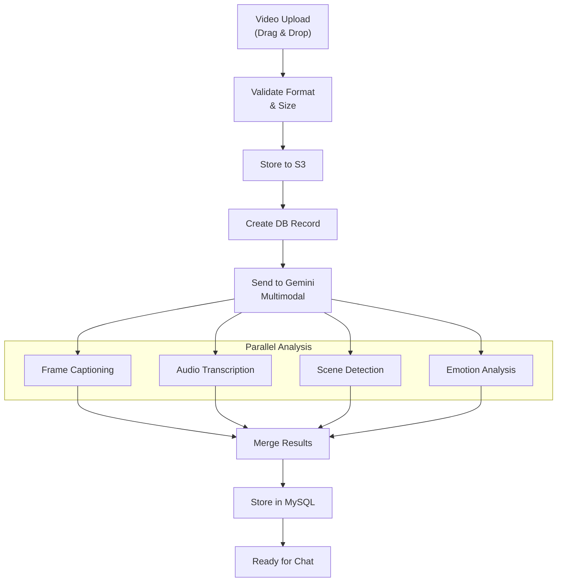
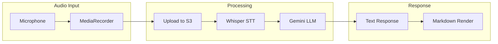
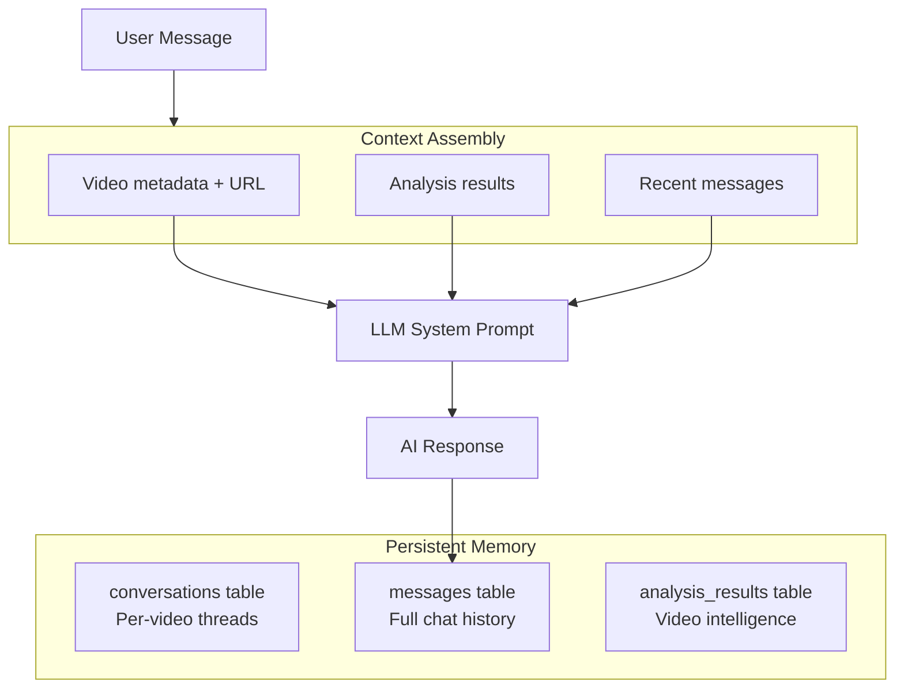
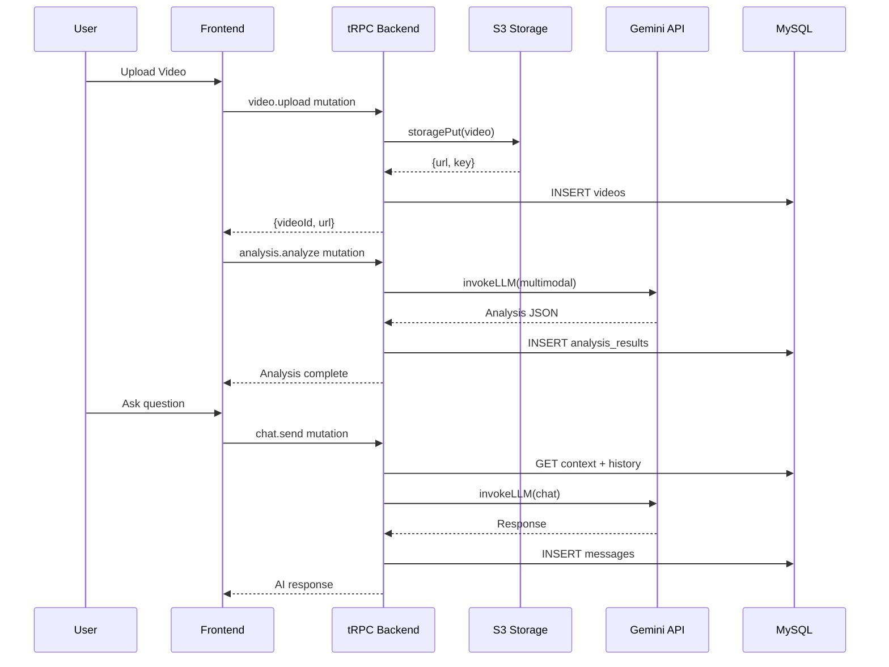
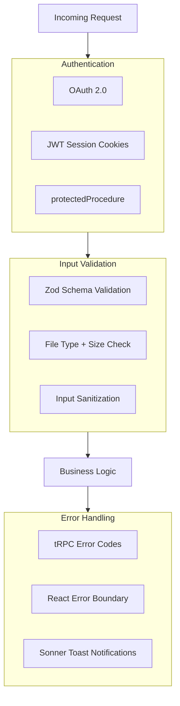

<div align="center">


# Ellie AI

### The State-of-the-Art AI Video Analysis Agent

**Upload any video. Ask anything. Ellie instantly analyzes every frame, transcribes every word, detects every sound, and remembers every detail — then talks to you about it.**

[](https://www.typescriptlang.org/)
[](https://react.dev/)
[](https://vitejs.dev/)
[](https://trpc.io/)
[](https://orm.drizzle.team/)
[](https://ai.google.dev/)
[](https://openai.com/research/whisper)
[](https://tailwindcss.com/)
[](LICENSE)

[Features](#-key-features) · [Architecture](#-architecture) · [Quick Start](#-quick-start) · [Tech Stack](#-tech-stack) · [API Reference](#-api-reference) · [Docs](#-documentation)

---


</div>

---

## The Vision

Most video analysis tools force you to manually scrub through footage, take notes, and piece together insights. They treat video as a static artifact. **Ellie treats video as a conversation partner.**

Ellie is a multimodal AI agent that combines Gemini 2.5 Flash's vision capabilities with Whisper's speech recognition, wrapped in a cinematic "Neural Noir" interface designed for speed and empathy. Upload a video, and within seconds Ellie has analyzed every frame, transcribed every word, detected emotional tones, and built a searchable knowledge graph — all accessible through natural language conversation or voice interaction.

---

## Screenshot

<div align="center">

</div>

---

## Key Features

| Capability | Description | Technology |
|---|---|---|
| **Frame Captioning** | Every frame analyzed with multimodal AI. Scene descriptions, object detection, text extraction, and visual context — all indexed and searchable. | Gemini 2.5 Flash Vision |
| **Audio Transcription** | Speech-to-text with speaker awareness. Every word captured with timestamps and confidence scores. | OpenAI Whisper |
| **Audio Detection** | Sound event detection beyond speech. Music, ambient noise, emotional tone, and environmental audio classified. | Gemini Multimodal |
| **Conversational Memory** | Persistent chat history. Ellie remembers your previous questions and builds on past analysis across sessions. | MySQL + tRPC |
| **Voice Interaction** | Talk to Ellie naturally. Record voice, get instant transcription, and receive AI responses about your video. | MediaRecorder + Whisper |
| **Instant Analysis** | Upload any video format. Parallel processing pipeline extracts frames, audio, and metadata simultaneously. | S3 + Gemini |

---

## Architecture

Ellie follows a modern full-stack architecture with type-safe end-to-end communication, server-side AI orchestration, and a reactive frontend.

### System Context

<div align="center">

</div>

The platform consists of a React 19 frontend communicating with an Express + tRPC backend over type-safe RPC calls. The backend orchestrates AI services (Gemini for multimodal analysis, Whisper for transcription), persists data in MySQL via Drizzle ORM, and stores video files in S3 object storage.

### Video Analysis Pipeline

<div align="center">

</div>

When a user uploads a video, the pipeline validates the format, stores the file in S3, then sends the video URL to Gemini 2.5 Flash for comprehensive multimodal analysis. The AI simultaneously performs frame captioning, audio transcription, scene detection, and emotion analysis. Results are merged into a unified timeline and stored in MySQL, making the video immediately queryable through natural language.

### Voice Interaction Pipeline

<div align="center">

</div>

Voice interaction uses the browser's MediaRecorder API to capture audio, uploads it to S3, sends it to Whisper for transcription, then feeds the transcript into Gemini with full video context for an intelligent response.

### Detailed Mermaid Diagrams

<details>
<summary><strong>1. Full System Context</strong></summary>



</details>

<details>
<summary><strong>2. Video Upload & Analysis Pipeline</strong></summary>



</details>

<details>
<summary><strong>3. Voice Interaction Flow</strong></summary>



</details>

<details>
<summary><strong>4. Conversational Memory</strong></summary>



</details>

<details>
<summary><strong>5. API Call Flow — Video Analysis</strong></summary>



</details>

<details>
<summary><strong>6. Security & Error Handling</strong></summary>



</details>

---

## Tech Stack

### Frontend

| Technology | Version | Purpose |
|---|---|---|
| **React** | 19.2 | UI framework with concurrent features |
| **Vite** | 7.1 | Build tool with HMR |
| **Tailwind CSS** | 4.1 | Utility-first styling with OKLCH colors |
| **Framer Motion** | 12.23 | Spring physics animations |
| **tRPC Client** | 11.6 | Type-safe API calls |
| **TanStack Query** | 5.90 | Server state management |
| **Wouter** | 3.3 | Lightweight routing |
| **Lucide React** | 0.453 | Icon library |
| **Streamdown** | 1.4 | Markdown rendering |
| **shadcn/ui** | Latest | Component library |

### Backend

| Technology | Version | Purpose |
|---|---|---|
| **Express** | 4.21 | HTTP server |
| **tRPC Server** | 11.6 | Type-safe API layer |
| **Drizzle ORM** | 0.44 | Type-safe database queries |
| **MySQL** | 8.x | Relational database |
| **Zod** | 4.1 | Runtime schema validation |
| **Jose** | 6.1 | JWT token handling |
| **SuperJSON** | 1.13 | Rich type serialization |
| **AWS SDK** | 3.x | S3 object storage |

### AI & Services

| Service | Purpose |
|---|---|
| **Gemini 2.5 Flash** | Multimodal video analysis, frame captioning, conversational AI |
| **OpenAI Whisper** | Speech-to-text transcription |
| **S3 Object Storage** | Video and audio file storage |

---

## Quick Start

### Prerequisites

| Tool | Version |
|---|---|
| Node.js | 22+ |
| pnpm | 10+ |
| MySQL | 8.x |

### Installation

```bash
# Clone the repository
git clone https://github.com/Alexi5000/Ellie.git
cd Ellie

# Install dependencies
pnpm install

# Set up environment variables
cp .env.example .env
# Edit .env with your database URL, API keys, etc.

# Push database schema
pnpm db:push

# Start development server
pnpm dev
```

### Environment Variables

| Variable | Description |
|---|---|
| `DATABASE_URL` | MySQL connection string |
| `JWT_SECRET` | Session cookie signing secret |
| `BUILT_IN_FORGE_API_URL` | LLM API endpoint |
| `BUILT_IN_FORGE_API_KEY` | LLM API bearer token |

### Available Scripts

```bash
pnpm dev          # Start development server with hot reload
pnpm build        # Production build (Vite + esbuild)
pnpm test         # Run vitest test suite
pnpm check        # TypeScript type checking
pnpm format       # Prettier formatting
pnpm db:push      # Generate and run database migrations
```

---

## Database Schema

Ellie uses five core tables managed by Drizzle ORM:

```
┌─────────────┐     ┌──────────────────┐     ┌───────────────────┐
│   users      │     │     videos       │     │ analysis_results  │
│─────────────│     │──────────────────│     │───────────────────│
│ id (PK)      │◄────│ userId (FK)      │     │ videoId (FK)      │
│ openId       │     │ id (PK)          │◄────│ id (PK)           │
│ name         │     │ title            │     │ type              │
│ email        │     │ url              │     │ content (JSON)    │
│ role         │     │ fileKey          │     │ confidence        │
│ createdAt    │     │ mimeType         │     │ timestamp         │
│ updatedAt    │     │ fileSize         │     │ createdAt         │
└─────────────┘     │ duration         │     └───────────────────┘
                     │ status           │
                     │ createdAt        │     ┌───────────────────┐
                     └──────────────────┘     │    messages        │
                                               │───────────────────│
┌──────────────────┐                           │ conversationId(FK)│
│  conversations   │                           │ id (PK)           │
│──────────────────│◄──────────────────────────│ role              │
│ id (PK)          │                           │ content           │
│ videoId (FK)     │                           │ messageType       │
│ userId (FK)      │                           │ metadata (JSON)   │
│ title            │                           │ createdAt         │
│ createdAt        │                           └───────────────────┘
└──────────────────┘
```

---

## API Reference

All API endpoints are type-safe tRPC procedures accessible via the `trpc` client.

### Video Operations

| Procedure | Type | Auth | Description |
|---|---|---|---|
| `video.upload` | Mutation | Required | Upload video (base64) to S3, create DB record |
| `video.list` | Query | Required | List all videos for authenticated user |
| `video.get` | Query | Required | Get single video with analysis results |

### Analysis Operations

| Procedure | Type | Auth | Description |
|---|---|---|---|
| `analysis.analyze` | Mutation | Required | Trigger Gemini multimodal analysis on a video |
| `analysis.results` | Query | Required | Get all analysis results for a video |

### Chat Operations

| Procedure | Type | Auth | Description |
|---|---|---|---|
| `chat.send` | Mutation | Required | Send message, get AI response with video context |
| `chat.history` | Query | Required | Get conversation history for a video |

### Voice Operations

| Procedure | Type | Auth | Description |
|---|---|---|---|
| `voice.transcribe` | Mutation | Required | Transcribe audio (base64) via Whisper |

### Auth Operations

| Procedure | Type | Auth | Description |
|---|---|---|---|
| `auth.me` | Query | Public | Get current authenticated user |
| `auth.logout` | Mutation | Public | Clear session cookie |

---

## Project Structure

```
Ellie/
├── assets/                    # Repository assets (icons, diagrams, screenshots)
├── client/                    # React 19 frontend
│   ├── index.html             # Entry HTML with Google Fonts
│   ├── public/                # Static assets
│   └── src/
│       ├── _core/hooks/       # Auth hooks
│       ├── components/        # Reusable UI components
│       │   └── ui/            # shadcn/ui component library
│       ├── contexts/          # React contexts (Theme)
│       ├── hooks/             # Custom hooks
│       ├── lib/               # tRPC client, utilities
│       ├── pages/             # Page components
│       │   ├── Home.tsx       # Landing page (Neural Noir)
│       │   ├── AnalysisWorkspace.tsx  # Main analysis interface
│       │   └── NotFound.tsx   # 404 page
│       ├── App.tsx            # Router & providers
│       ├── main.tsx           # Entry point
│       └── index.css          # Global styles & theme
├── server/                    # Express + tRPC backend
│   ├── _core/                 # Framework plumbing
│   │   ├── llm.ts             # Gemini LLM integration
│   │   ├── voiceTranscription.ts  # Whisper integration
│   │   ├── env.ts             # Environment config
│   │   ├── trpc.ts            # tRPC initialization
│   │   └── ...                # OAuth, context, cookies
│   ├── db.ts                  # Database query helpers
│   ├── routers.ts             # tRPC procedure definitions
│   ├── storage.ts             # S3 storage helpers
│   ├── routers.test.ts        # Backend tests (10 tests)
│   └── auth.logout.test.ts    # Auth tests
├── drizzle/                   # Database schema & migrations
│   ├── schema.ts              # Table definitions
│   ├── relations.ts           # Table relations
│   └── migrations/            # SQL migration files
├── shared/                    # Shared types & constants
├── docs/                      # Documentation
├── package.json               # Dependencies & scripts
├── vite.config.ts             # Vite configuration
├── drizzle.config.ts          # Drizzle ORM configuration
├── vitest.config.ts           # Test configuration
└── tsconfig.json              # TypeScript configuration
```

---

## Design System — Neural Noir

Ellie uses a custom **"Neural Noir"** design system — a cinematic dark interface inspired by the intersection of film noir and neural network visualization.

### Color Palette

| Token | Value | Usage |
|---|---|---|
| `--background` | `oklch(0.13 0.02 270)` | Deep charcoal base |
| `--foreground` | `oklch(0.93 0.01 270)` | Primary text |
| `--amber` | `oklch(0.82 0.15 75)` | Primary accent (warmth) |
| `--cyan` | `oklch(0.78 0.12 195)` | Analysis/data accent |
| `--glass` | `rgba(255,255,255,0.03)` | Frosted glass panels |

### Typography

| Font | Usage |
|---|---|
| **Space Grotesk** | Display headings, navigation |
| **IBM Plex Sans** | Body text, descriptions |
| **JetBrains Mono** | Code, metrics, timestamps |

### Signature Elements

The design features animated waveform visualizations, floating particle effects, frosted glass panels with subtle borders, and spring physics animations via Framer Motion. The warm amber/gold palette represents human warmth meeting machine intelligence, while cyan accents indicate active analysis states.

---

## Testing

Ellie includes a comprehensive test suite using Vitest:

```bash
# Run all tests
pnpm test

# Current test results:
# ✓ server/auth.logout.test.ts (1 test)
# ✓ server/routers.test.ts (9 tests)
# Test Files  2 passed (2)
#      Tests  10 passed (10)
```

Tests cover authentication flows, authorization guards on all protected procedures, and input validation.

---

## Documentation

| Document | Description |
|---|---|
| [Architecture Docs](docs/) | Detailed technical documentation |
| [Contributing Guide](CONTRIBUTING.md) | Development workflow and coding standards |
| [Service Discovery](docs/service-discovery.md) | Service architecture documentation |

---

## Performance Targets

| Metric | Target | Implementation |
|---|---|---|
| **Video Upload** | < 3s for 100MB | Direct S3 upload with progress |
| **Analysis Start** | < 500ms | Immediate pipeline trigger |
| **Chat Response** | < 2s | Gemini with pre-assembled context |
| **Voice Transcription** | < 1s | Whisper with optimized audio |
| **UI Interaction** | < 16ms | React 19 concurrent rendering |
| **First Paint** | < 1.5s | Vite code splitting + lazy loading |

---

## Roadmap

| Phase | Feature | Status |
|---|---|---|
| v1.0 | Video upload + AI analysis + chat | **Complete** |
| v1.0 | Voice interaction (record + transcribe) | **Complete** |
| v1.0 | Neural Noir UI design system | **Complete** |
| v1.0 | Persistent conversational memory | **Complete** |
| v1.1 | Streaming AI responses (SSE) | Planned |
| v1.1 | Video library + history dashboard | Planned |
| v1.2 | Export analysis as PDF reports | Planned |
| v1.2 | Shareable analysis links | Planned |
| v2.0 | Real-time voice conversation (WebSocket) | Planned |
| v2.0 | Multi-video comparative analysis | Planned |

---

## Contributing

We welcome contributions! Please see our [Contributing Guide](CONTRIBUTING.md) for details on development workflow, coding standards, and pull request process.

---

## License

This project is licensed under the MIT License — see the [LICENSE](LICENSE) file for details.

---

<div align="center">

**Built with Gemini 2.5 Flash, OpenAI Whisper, React 19, and tRPC 11**

**Maintained by**: Alex Cinovoj, TechTide AI

<sub>Ellie AI — See Everything. Understand Everything.</sub>

</div>
