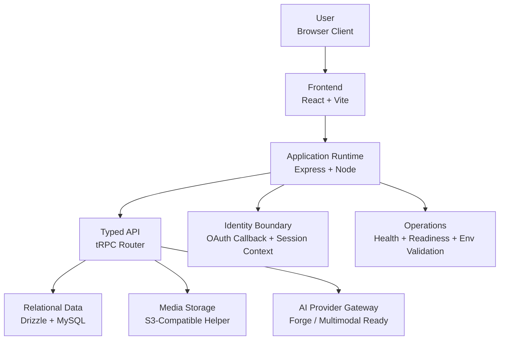

<p align="center">
  
</p>

<h1 align="center">Ellie AI</h1>

<p align="center">
  <strong>A production-grade video intelligence workspace for teams that need searchable, conversational understanding over media.</strong>
</p>

<p align="center">
  <a href="#platform-overview">Platform</a> ·
  <a href="#product-experience">Experience</a> ·
  <a href="#architecture">Architecture</a> ·
  <a href="#stack">Stack</a> ·
  <a href="#local-development">Runbook</a> ·
  <a href="#production-readiness">Production</a> ·
  <a href="#template-standard">Template</a>
</p>

<p align="center">
  <a href="https://www.typescriptlang.org/"></a>
  <a href="https://react.dev/"></a>
  <a href="https://vite.dev/"></a>
  <a href="https://expressjs.com/"></a>
  <a href="https://trpc.io/"></a>
  <a href="LICENSE"></a>
</p>

---

<p align="center">
  
</p>

## Platform Overview

> **Ellie is built like a SaaS platform, not a demo.** The repository contains a React application, a Node/Express backend, a typed tRPC API surface, a Drizzle/MySQL data layer, S3-compatible storage integration points, Docker packaging, environment validation, tests, production-readiness documentation, release notes, contribution standards, and a reusable README template for the rest of the portfolio.

Ellie turns video into an operational knowledge surface. A team can upload media, preserve the source context, generate structured analysis, and use the result inside a conversational workspace. The project is intentionally organized as a full-stack product repository so engineering, product, operations, and deployment reviewers can understand the application without reverse-engineering scattered files.

| Platform Card  | Current State                                                                                                                     | Production Value                                                                  |
| -------------- | --------------------------------------------------------------------------------------------------------------------------------- | --------------------------------------------------------------------------------- |
| **Product**    | Video intelligence workspace with upload, analysis, chat, and voice transcription surfaces.                                       | Gives the repository a clear SaaS identity and user-facing workflow.              |
| **Frontend**   | React 19, Vite, Tailwind-oriented UI, routed pages, product assets, and typed API consumption.                                    | Provides a shippable browser experience rather than a placeholder interface.      |
| **Backend**    | Express server, tRPC router, health/readiness endpoints, OAuth callback surface, and static asset serving.                        | Creates a deployable application runtime with an inspectable operations boundary. |
| **Data**       | Drizzle schema and migrations for users, videos, analysis results, conversations, and messages.                                   | Defines durable SaaS entities and persistence boundaries.                         |
| **Operations** | Dockerfile, Compose file, environment validator, CI-compatible scripts, Prettier gate, tests, and production validation commands. | Makes build and deployment readiness repeatable.                                  |
| **Governance** | MIT license, setup documentation, release notes, PR template, contribution guidance, and reusable README template.                | Makes the repository look and operate like a mature engineering asset.            |

## Product Experience

Ellie is designed around a simple operating model: ingest video, extract intelligence, and make that intelligence usable. The interface is not presented as a generic dashboard. It is framed as a focused workspace for media understanding, where every backend primitive maps to a product concept that a SaaS customer or reviewer can recognize.

| Experience Panel             | What the User Sees                                                          | What the System Owns                                                         |
| ---------------------------- | --------------------------------------------------------------------------- | ---------------------------------------------------------------------------- |
| **Media Intake**             | A video-first workflow for capturing content context.                       | Upload procedures, storage keys, processing status, and ownership metadata.  |
| **Structured Analysis**      | A place to review extracted summaries, timestamps, confidence, and results. | Analysis records tied to videos through the Drizzle schema.                  |
| **Conversational Workspace** | Chat over the media context instead of searching through raw files.         | Conversation and message entities connected to users and source videos.      |
| **Voice Surface**            | Transcription-oriented primitives for spoken content workflows.             | Backend voice transcription procedure boundaries and testable API contracts. |
| **Operational State**        | Health and readiness signals for deployers.                                 | `/api/health`, `/api/readiness`, and `/api/ready` endpoints.                 |

<p align="center">
  
</p>

## Architecture

Ellie keeps the repository TypeScript-first across the product boundary. React owns the browser application.[1] Vite owns the build pipeline.[2] Express owns the runtime.[3] tRPC keeps client and server contracts aligned.[4] Drizzle maps the relational data model into typed application code.[5] Vitest and validation scripts keep the release path observable.[6]


```mermaid
graph TB
    User["User\nBrowser Client"]
    Frontend["Frontend\nReact + Vite"]
    Server["Application Runtime\nExpress + Node"]
    API["Typed API\ntRPC Router"]
    Auth["Identity Boundary\nOAuth Callback + Session Context"]
    DB["Relational Data\nDrizzle + MySQL"]
    Storage["Media Storage\nS3-Compatible Helper"]
    AI["AI Provider Gateway\nForge / Multimodal Ready"]
    Ops["Operations\nHealth + Readiness + Env Validation"]

    User --> Frontend
    Frontend --> Server
    Server --> API
    Server --> Auth
    API --> DB
    API --> Storage
    API --> AI
    Server --> Ops
```

| System Boundary        | Primary Paths                                              | Responsibility                                                                               |
| ---------------------- | ---------------------------------------------------------- | -------------------------------------------------------------------------------------------- |
| **Client Application** | `client/`, `client/src/`, `assets/`                        | Owns the browser product, visual presentation, and frontend API consumption.                 |
| **Server Runtime**     | `server/_core/index.ts`, `server/routers.ts`               | Owns HTTP serving, health checks, readiness, tRPC procedures, and production bundle hosting. |
| **Shared Contracts**   | `shared/`, `shared/_core/`                                 | Holds shared constants and cross-boundary TypeScript contracts.                              |
| **Persistence**        | `drizzle/schema.ts`, `drizzle/migrations/`, `server/db.ts` | Defines relational SaaS entities and database connection behavior.                           |
| **Storage**            | `server/storage.ts`                                        | Provides object-storage integration points for media and generated artifacts.                |
| **Automation**         | `scripts/validate-env.ts`, `package.json`, `.github/`      | Defines repeatable validation, CI-compatible commands, and release checks.                   |
| **Knowledge Base**     | `docs/`                                                    | Captures deployment, testing, migration, development, and production readiness context.      |

## Stack

| Layer                | Technology                 |              Version or Track | Why It Is Here                                                                    |
| -------------------- | -------------------------- | ----------------------------: | --------------------------------------------------------------------------------- |
| **Language**         | TypeScript                 |                         5.9.3 | Keeps the frontend, backend, contracts, tests, and scripts in one type system.    |
| **Frontend Runtime** | React                      |                        19.2.x | Provides the application component model and product surface.                     |
| **Frontend Build**   | Vite                       |                           7.x | Builds the browser application and powers local development.                      |
| **Server Runtime**   | Node.js + Express          |                Express 4.21.x | Hosts the API, serves production assets, and exposes operational endpoints.       |
| **API Contract**     | tRPC                       |                        11.6.x | Keeps API procedures strongly typed from server to client.                        |
| **Database Layer**   | Drizzle ORM + MySQL driver | Drizzle 0.44.x, mysql2 3.15.x | Provides typed relational schema, migrations, and MySQL-compatible access.        |
| **Validation**       | Zod                        |                         4.1.x | Supports typed validation boundaries for inputs and configuration-adjacent flows. |
| **Testing**          | Vitest                     |                         2.1.x | Runs server and application tests in CI-compatible form.                          |
| **Formatting**       | Prettier                   |                         3.6.x | Enforces deterministic repository formatting.                                     |
| **Packaging**        | Docker + Compose           |            Repository-defined | Provides a container-ready deployment path and local service orchestration.       |

## SaaS Capability Map

This repository is structured so the product can grow into a broader SaaS platform without changing its core shape. The current milestone emphasizes the foundation: working application shell, typed API, data model, operations surface, and documentation. Billing, organizations, queue workers, observability vendors, and managed deployment settings can be layered on top of this foundation when the external services are selected.

| Capability             | Implemented Foundation                                                                                                 | Next Production Extension                                                                         |
| ---------------------- | ---------------------------------------------------------------------------------------------------------------------- | ------------------------------------------------------------------------------------------------- |
| **Authentication**     | User context, logout behavior, OAuth callback route, and owner-oriented environment fields.                            | Connect managed identity provider, session persistence policy, tenant membership, and audit logs. |
| **Media Intelligence** | Video upload procedure, analysis procedure boundaries, structured result entities, and provider gateway configuration. | Add provider execution queues, retry policies, prompt/version logging, and cost telemetry.        |
| **Conversation Layer** | Conversation and message entities tied to videos and users.                                                            | Add retrieval ranking, source citations, moderation, and memory controls.                         |
| **Storage**            | S3-compatible helper and storage-key model.                                                                            | Add signed uploads, lifecycle rules, malware scanning, and regional retention policy.             |
| **Database**           | MySQL-compatible schema and migration commands.                                                                        | Add managed database backups, migration runbooks, seed data, and tenant isolation policy.         |
| **Operations**         | Health/readiness endpoints, environment validation, Docker packaging, and CI commands.                                 | Add metrics, structured logs, alerting, uptime monitoring, and release automation.                |
| **Governance**         | License, README, setup docs, releases, contribution guidance, PR template, and reusable template.                      | Add security policy, code owners, architecture decision records, and support escalation paths.    |

## Repository Map

| Path                       | Box                              | What Belongs There                                                                                  |
| -------------------------- | -------------------------------- | --------------------------------------------------------------------------------------------------- |
| `client/`                  | **Product Surface**              | React application code, UI composition, routes, browser assets, and client-side integration.        |
| `server/`                  | **Application Core**             | Express runtime, tRPC routers, OAuth hooks, storage, database access, and server tests.             |
| `shared/`                  | **Contract Layer**               | Shared constants, types, and cross-boundary primitives.                                             |
| `drizzle/`                 | **Data Plane**                   | Schema definitions, migrations, metadata, and relational product entities.                          |
| `scripts/`                 | **Automation**                   | Environment and release validation scripts.                                                         |
| `docs/`                    | **Operator Knowledge**           | Deployment, CI/CD, testing, migration, development, marketing-site, and production-readiness notes. |
| `docs/templates/`          | **Portfolio Standard**           | Reusable documentation templates for other repositories.                                            |
| `assets/`                  | **Brand Layer**                  | README cover, icon, and product imagery.                                                            |
| `.github/`                 | **Repository Governance**        | Workflows and pull-request automation files.                                                        |
| `frontend/` and `backend/` | **Legacy Compatibility Bridges** | Compatibility package surfaces used by existing protected workflow expectations.                    |

## Local Development

> **Clone, install, validate, run.** Ellie is designed to make the first developer path obvious while keeping production secrets out of the repository.

```bash
git clone https://github.com/Alexi5000/Ellie.git
cd Ellie
pnpm install --frozen-lockfile
cp .env.example .env
pnpm validate:env
pnpm dev
```

| Requirement          |         Expected Baseline | Notes                                                                 |
| -------------------- | ------------------------: | --------------------------------------------------------------------- |
| **Node.js**          |               22 or newer | The repository was validated against the current Node runtime family. |
| **pnpm**             |                      10.x | The project declares pnpm through `packageManager`.                   |
| **Database**         |          MySQL-compatible | Required for production readiness and Drizzle migration execution.    |
| **Storage**          |             S3-compatible | Required for real media upload and artifact persistence.              |
| **Provider Gateway** | Forge-compatible endpoint | Required for production multimodal analysis flows.                    |

## Environment Model

The environment file is intentionally explicit. Development can use safe placeholders for local validation. Production must supply real credentials through the deployment platform or secret manager.

| Variable                 | Required for Production | Purpose                                                                           |
| ------------------------ | ----------------------: | --------------------------------------------------------------------------------- |
| `DATABASE_URL`           |                     Yes | MySQL-compatible database connection string used by the server and Drizzle layer. |
| `JWT_SECRET`             |                     Yes | High-entropy signing secret for protected session and auth-related flows.         |
| `BUILT_IN_FORGE_API_URL` |                     Yes | Provider gateway URL for AI and multimodal execution.                             |
| `BUILT_IN_FORGE_API_KEY` |                     Yes | Provider gateway credential.                                                      |
| `VITE_APP_ID`            |                      No | Public application identifier exposed to the browser bundle.                      |
| `VITE_APP_TITLE`         |                      No | Public application title for branded deployments.                                 |
| `VITE_APP_LOGO_URL`      |                      No | Public logo URL for branded deployments.                                          |
| `OAUTH_SERVER_URL`       |                      No | Optional OAuth authority for authenticated deployments.                           |
| `OWNER_OPEN_ID`          |                      No | Optional initial owner identity.                                                  |
| `PORT`                   |                      No | Runtime HTTP port.                                                                |

```bash
pnpm validate:env
NODE_ENV=production pnpm validate:env:production
```

## Commands

| Command                        | Box                        | What It Proves                                                                  |
| ------------------------------ | -------------------------- | ------------------------------------------------------------------------------- |
| `pnpm dev`                     | **Developer Loop**         | Starts the Express runtime with development middleware and hot reload behavior. |
| `pnpm build`                   | **Release Build**          | Builds the Vite frontend and bundles the Node server into `dist/`.              |
| `pnpm start`                   | **Production Runtime**     | Starts the compiled application server from `dist/index.js`.                    |
| `pnpm check`                   | **Type Gate**              | Runs TypeScript without emitting artifacts.                                     |
| `pnpm test`                    | **Test Gate**              | Runs the Vitest suite.                                                          |
| `pnpm format:check`            | **Formatting Gate**        | Verifies repository formatting without rewriting files.                         |
| `pnpm format`                  | **Formatting Fix**         | Applies the repository’s Prettier rules.                                        |
| `pnpm validate:env`            | **Configuration Gate**     | Validates local environment completeness.                                       |
| `pnpm validate:env:production` | **Production Config Gate** | Validates production-required environment fields.                               |
| `pnpm ci`                      | **Composite Gate**         | Runs environment validation, typecheck, tests, and build.                       |
| `pnpm db:generate`             | **Migration Authoring**    | Generates Drizzle migration artifacts.                                          |
| `pnpm db:migrate`              | **Migration Apply**        | Applies pending Drizzle migrations.                                             |
| `pnpm preview`                 | **Local Release Preview**  | Builds and starts the compiled production app locally.                          |

## Production Readiness

Ellie’s repository is built to present the difference between what is already committed and what a deployment owner must supply. The application code, schema, runtime, scripts, docs, and packaging are present. Production deployment still requires real managed infrastructure, secrets, DNS, TLS, monitoring, and provider credentials.

| Readiness Area        | Repository Status                                                              | Deployment Owner Action                                                                    |
| --------------------- | ------------------------------------------------------------------------------ | ------------------------------------------------------------------------------------------ |
| **Application Build** | `pnpm build` compiles frontend and backend artifacts.                          | Run build in the deployment platform and persist `dist/` as the release artifact.          |
| **Type Safety**       | `pnpm check` validates the TypeScript project.                                 | Keep this gate blocking on protected branches.                                             |
| **Tests**             | `pnpm test` runs Vitest coverage for core server behavior.                     | Expand test coverage as provider and billing flows are connected.                          |
| **Formatting**        | `pnpm format:check` verifies deterministic Markdown and source formatting.     | Keep format checks in CI before merge.                                                     |
| **Configuration**     | `.env.example` and `scripts/validate-env.ts` document required runtime values. | Supply production secrets through a managed secret store.                                  |
| **Database**          | Drizzle schema and migration scripts are committed.                            | Provision MySQL-compatible database and run migrations through the release process.        |
| **Storage**           | S3-compatible helper exists.                                                   | Provision buckets, access policy, lifecycle policy, and signed-upload flow.                |
| **Containerization**  | Dockerfile and Compose file exist.                                             | Build, scan, and deploy the container through the chosen platform.                         |
| **Security**          | Baseline security headers and secret validation are present.                   | Add managed TLS, rate limiting, dependency scanning, audit logging, and incident response. |

## Deployment Path

```bash
pnpm install --frozen-lockfile
pnpm validate:env:production
pnpm check
pnpm test
pnpm build
pnpm start
```

| Deployment Step | Description                                                        | Success Signal                                                     |
| --------------- | ------------------------------------------------------------------ | ------------------------------------------------------------------ |
| **Install**     | Restore the lockfile-defined dependency graph.                     | `pnpm install --frozen-lockfile` exits cleanly.                    |
| **Configure**   | Inject production database, provider, auth, and storage variables. | `pnpm validate:env:production` passes without placeholder secrets. |
| **Verify**      | Run typecheck, tests, and formatting/build gates.                  | CI reports green validation gates.                                 |
| **Migrate**     | Generate and apply database migrations.                            | Drizzle migration command completes against the target database.   |
| **Release**     | Start the compiled Node server.                                    | `/api/health` and `/api/readiness` return successful responses.    |
| **Observe**     | Attach logs, metrics, alerting, and uptime monitoring.             | Operators can detect incidents before users report them.           |

## API and Operations Surface

| Endpoint              | Method         | Box                   | Expected Use                                                    |
| --------------------- | -------------- | --------------------- | --------------------------------------------------------------- |
| `/api/health`         | `GET`          | **Liveness**          | Container checks and platform restart decisions.                |
| `/api/readiness`      | `GET`          | **Readiness**         | Dependency and configuration checks before traffic is routed.   |
| `/api/ready`          | `GET`          | **Compatibility**     | Short readiness alias for platforms that prefer compact probes. |
| `/api/oauth/callback` | `GET`          | **Identity Boundary** | OAuth callback surface for authenticated deployments.           |
| `/api/trpc/*`         | `GET` / `POST` | **Application API**   | Type-safe frontend-to-backend procedure calls.                  |

## Data Model

| Entity             | Box                     | Purpose                                                                        |
| ------------------ | ----------------------- | ------------------------------------------------------------------------------ |
| `users`            | **Identity**            | Stores user identity and profile metadata.                                     |
| `videos`           | **Media Asset**         | Stores uploaded video metadata, storage keys, processing state, and ownership. |
| `analysis_results` | **Intelligence Record** | Stores timestamped multimodal outputs and confidence metadata.                 |
| `conversations`    | **Workspace Thread**    | Stores per-video conversational threads.                                       |
| `messages`         | **Dialogue Event**      | Stores user and assistant messages with optional metadata.                     |

## Security and Compliance Posture

Ellie is not claiming a completed compliance program. It is claiming a repository structure that makes a compliance program possible. The committed baseline includes explicit environment modeling, no committed production secrets, runtime health probes, readiness probes, security header defaults, typed contracts, repeatable validation commands, and visible deployment documentation.

| Control Area         | Repository Foundation                                              | Recommended Production Layer                                                |
| -------------------- | ------------------------------------------------------------------ | --------------------------------------------------------------------------- |
| **Secrets**          | `.env.example` documents required values without real credentials. | Managed secret store, rotation policy, environment-specific access control. |
| **Transport**        | Application is ready to sit behind managed HTTPS.                  | TLS termination, HSTS, secure cookies, and certificate monitoring.          |
| **Access**           | OAuth callback and owner configuration surfaces exist.             | Full identity provider, RBAC, tenant membership, and audit trails.          |
| **Abuse Protection** | API boundaries are centralized through Express and tRPC.           | Rate limiting, WAF, bot controls, and anomaly detection.                    |
| **Supply Chain**     | Lockfile and CI-compatible validation commands exist.              | Dependency review, vulnerability scanning, pinned deployment images.        |
| **Observability**    | Health/readiness endpoints are committed.                          | Structured logs, traces, metrics, alerting, and dashboard ownership.        |

## Documentation System

| Document                                 | Purpose                                                                                |
| ---------------------------------------- | -------------------------------------------------------------------------------------- |
| `README.md`                              | Product-facing and engineering-facing source of truth for Ellie’s SaaS platform shape. |
| `docs/PRODUCTION_READINESS.md`           | Production readiness notes and release considerations.                                 |
| `docs/deployment/`                       | Deployment-specific guidance.                                                          |
| `docs/testing/`                          | Test and validation guidance.                                                          |
| `docs/development/`                      | Local development and engineering workflow notes.                                      |
| `docs/ci-cd/`                            | Continuous integration and delivery notes.                                             |
| `docs/migration/`                        | Migration and legacy compatibility context.                                            |
| `docs/marketing-site/`                   | Brand and marketing-site references.                                                   |
| `docs/templates/SAAS_README_TEMPLATE.md` | Reusable README standard for other application repositories.                           |

## Template Standard

A reusable README system has been added at `docs/templates/SAAS_README_TEMPLATE.md`. It is designed to be copied into the rest of the portfolio and filled with repository-specific facts. The standard is intentionally product-grade: it asks each repository to present its product promise, stack, architecture, capability map, runbook, production posture, security posture, validation gates, and roadmap in the same polished format.

> **Template rule:** every impressive claim must be backed by a file, command, endpoint, schema, workflow, or deployment artifact in the repository. The tone can be premium, but the content must stay real.

## Roadmap

| Horizon   | Workstream                                                                                                       | Outcome                                                                                     |
| --------- | ---------------------------------------------------------------------------------------------------------------- | ------------------------------------------------------------------------------------------- |
| **Now**   | Repository hardening, documentation polish, validation gates, and production configuration clarity.              | Ellie reads and builds like a complete full-stack application repository.                   |
| **Next**  | Managed database, object storage, provider gateway, authentication, and deployment environment selection.        | Ellie becomes a live SaaS deployment with real infrastructure behind the committed runtime. |
| **Later** | Tenant model, billing, queues, provider observability, retrieval quality, audit trails, and compliance controls. | Ellie becomes a scalable commercial media-intelligence platform.                            |

## License

Ellie is released under the [MIT License](LICENSE). The license file is included at the repository root so downstream reviewers, contributors, and deployment owners can evaluate usage terms without ambiguity.

## References

[1]: https://react.dev/ "React Documentation"
[2]: https://vite.dev/ "Vite Documentation"
[3]: https://expressjs.com/ "Express Documentation"
[4]: https://trpc.io/ "tRPC Documentation"
[5]: https://orm.drizzle.team/ "Drizzle ORM Documentation"
[6]: https://vitest.dev/ "Vitest Documentation"
[7]: https://docs.docker.com/ "Docker Documentation"
