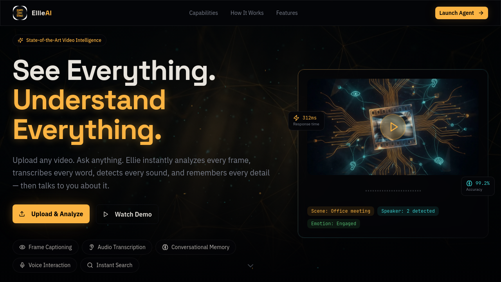
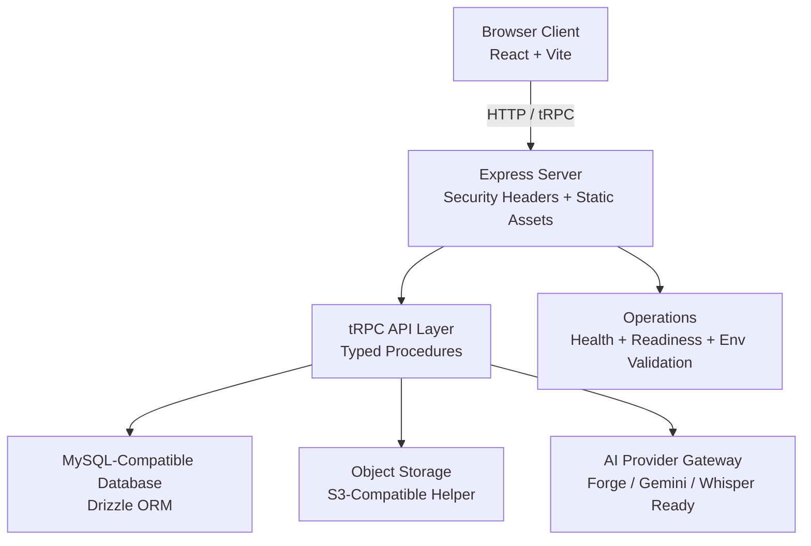

<div align="center">


# Ellie AI

### Video intelligence, built as a real product.

**Ellie is a production-shaped full-stack application for uploading video, preserving structured analysis, and turning media context into a searchable conversational workspace.**

[](https://www.typescriptlang.org/)
[](https://react.dev/)
[](https://vite.dev/)
[](https://expressjs.com/)
[](https://trpc.io/)
[](https://orm.drizzle.team/)
[](LICENSE)

[Experience](#experience) · [Architecture](#architecture) · [Backend](#backend) · [Quick Start](#quick-start) · [Production](#production-readiness) · [Docs](#documentation)

</div>

---


## Experience

Ellie is designed to feel finished before it asks to be extended. The repository contains a complete React application shell, a TypeScript backend, shared contracts, database schema, Docker packaging, environment validation, test coverage, and production-readiness documentation. It is no longer a loose prototype; it is a coherent application repository that a reviewer can clone, build, inspect, and prepare for deployment.

> Ellie’s promise is direct: upload a video, keep the source context intact, extract structured insight, and make the result available to an AI-assisted workspace.

The product surface is intentionally cinematic, but the foundation is practical. React provides the component model for the interface, Vite provides the application build pipeline, Express provides the Node server runtime, tRPC keeps the API contract type-safe from client to server, and Drizzle maps the relational data model into TypeScript.[1] [2] [3] [4] [5]

| Product Layer | What Is Built                                                                                                                 | Why It Matters                                                                                      |
| ------------- | ----------------------------------------------------------------------------------------------------------------------------- | --------------------------------------------------------------------------------------------------- |
| Frontend      | React, Vite, Tailwind, routed pages, an analysis workspace, responsive layout, and error boundaries.                          | The application opens like a polished product rather than a collection of disconnected screens.     |
| Backend       | Express runtime, typed tRPC router, health and readiness endpoints, environment parsing, database helper, and storage helper. | Deployment owners can inspect service state and evolve the API without breaking frontend contracts. |
| Data          | Drizzle schema for users, videos, analysis records, conversations, and messages.                                              | The core media-intelligence entities are modeled as durable product data.                           |
| Operations    | Dockerfile, `.dockerignore`, `.env.example`, release gates, validation scripts, and readiness documentation.                  | The repository has repeatable paths for build, review, and deployment preparation.                  |
| Governance    | Setup guide, release notes, contribution standards, pull-request template, and MIT license.                                   | The project now reads and behaves like a professional application repository.                       |

## Screenshot

<div align="center">

</div>

## Architecture

Ellie keeps the application stack TypeScript-first. This keeps UI code, server code, shared contracts, validation scripts, database access, and tests in one language, reducing drift between the interface and the backend as the product grows.


```mermaid
graph TB
    Browser["Browser Client\nReact + Vite"]
    Express["Express Server\nSecurity Headers + Static Assets"]
    TRPC["tRPC API Layer\nTyped Procedures"]
    DB["MySQL-Compatible Database\nDrizzle ORM"]
    Storage["Object Storage\nS3-Compatible Helper"]
    AI["AI Provider Gateway\nForge / Gemini / Whisper Ready"]
    Ops["Operations\nHealth + Readiness + Env Validation"]

    Browser -->|HTTP / tRPC| Express
    Express --> TRPC
    TRPC --> DB
    TRPC --> Storage
    TRPC --> AI
    Express --> Ops
```

| Directory  | Role                                                                                                      | Production Value                                                             |
| ---------- | --------------------------------------------------------------------------------------------------------- | ---------------------------------------------------------------------------- |
| `client/`  | React application, pages, components, hooks, styles, and tRPC client setup.                               | Owns the complete browser experience.                                        |
| `server/`  | Express runtime, tRPC router, database access, storage integration, cookies, provider helpers, and tests. | Owns the application API and deployment runtime.                             |
| `shared/`  | Shared TypeScript constants, types, and cross-boundary contracts.                                         | Keeps frontend and backend expectations aligned.                             |
| `drizzle/` | Database schema, relations, and migrations.                                                               | Defines persistent product entities and migration history.                   |
| `scripts/` | Environment validation and automation.                                                                    | Makes release checks repeatable.                                             |
| `docs/`    | Deployment, CI, testing, production readiness, migration, and marketing-site references.                  | Gives maintainers a single knowledge base for operating and extending Ellie. |
| `assets/`  | README imagery and product presentation assets.                                                           | Makes the repository presentation complete and professional.                 |

## Backend

The backend is built as a hardened baseline rather than a placeholder. It validates configuration, exposes liveness and readiness endpoints, hosts the typed application API, serves the production bundle, and keeps database and storage integration points visible for the next deployment milestone.

| Backend Component | Path                      | Purpose                                                                                                                  |
| ----------------- | ------------------------- | ------------------------------------------------------------------------------------------------------------------------ |
| Server entrypoint | `server/_core/index.ts`   | Starts Express, applies baseline security headers, mounts tRPC, serves static assets, and exposes operational endpoints. |
| Environment model | `server/_core/env.ts`     | Classifies configuration by environment and reports safe readiness metadata without leaking secrets.                     |
| API router        | `server/routers.ts`       | Defines the typed application procedures consumed by the frontend.                                                       |
| Database helper   | `server/db.ts`            | Creates the Drizzle/MySQL connection and provides readiness checks.                                                      |
| Storage helper    | `server/storage.ts`       | Provides S3-compatible media and artifact storage integration points.                                                    |
| Schema            | `drizzle/schema.ts`       | Models users, videos, analysis results, conversations, and messages.                                                     |
| Validation script | `scripts/validate-env.ts` | Enforces local and production configuration expectations.                                                                |

## API and Operations Surface

Ellie exposes a practical operations surface for local development, container checks, and deployment review. Liveness answers whether the process is running. Readiness answers whether the runtime has the configuration and dependencies required to receive production traffic.

| Endpoint         | Method         | Role            | Expected Use                                                               |
| ---------------- | -------------- | --------------- | -------------------------------------------------------------------------- |
| `/api/health`    | `GET`          | Liveness        | Container healthcheck and platform restart decisions.                      |
| `/api/readiness` | `GET`          | Readiness       | Pre-release and rollout dependency checks.                                 |
| `/api/ready`     | `GET`          | Readiness alias | Compatibility with deployment platforms that prefer short readiness paths. |
| `/api/trpc/*`    | `GET` / `POST` | Application API | Type-safe frontend-to-backend procedure calls.                             |

The server applies a baseline set of production security headers, including content-type sniffing protection, frame protection, referrer policy, and a restrictive permissions policy. Hosted production deployments should add managed HTTPS, secret rotation, dependency scanning, rate limiting, request logging, and alerting.

## Data Model

Ellie’s schema captures the durable objects required for a video-intelligence workspace. It is intentionally clear: the first production-ready repository milestone should make the product shape obvious before adding queues, billing, tenants, or provider execution logs.

| Entity             | Purpose                                                                        | Relationship                                 |
| ------------------ | ------------------------------------------------------------------------------ | -------------------------------------------- |
| `users`            | Stores identity and profile metadata.                                          | Owns videos and conversations.               |
| `videos`           | Stores uploaded media metadata, storage keys, processing state, and ownership. | Belongs to a user and owns analysis records. |
| `analysis_results` | Stores timestamped multimodal outputs and confidence metadata.                 | Belongs to a video.                          |
| `conversations`    | Stores per-video conversational threads.                                       | Belongs to a user and video.                 |
| `messages`         | Stores user and assistant messages with optional metadata.                     | Belongs to a conversation.                   |

## Quick Start

The repository uses pnpm and a single TypeScript application workspace. The setup below installs dependencies, copies the environment template, validates local configuration, and starts the development server.

```bash
git clone https://github.com/Alexi5000/Ellie.git
cd Ellie
pnpm install --frozen-lockfile
cp .env.example .env
pnpm validate:env
pnpm dev
```

| Requirement               | Version or Provider | Notes                                                                |
| ------------------------- | ------------------: | -------------------------------------------------------------------- |
| Node.js                   |         22 or newer | Matches the intended server runtime and current dependency baseline. |
| pnpm                      |                10.x | Declared in `package.json` through the package-manager field.        |
| MySQL-compatible database |      8.x compatible | Required for production database readiness and Drizzle migrations.   |
| Object storage            |       S3-compatible | Required for real media upload and artifact storage workflows.       |
| AI/provider gateway       |    Forge-compatible | Required for production multimodal provider execution.               |

## Configuration

Configuration is documented in `.env.example`. Development can run with placeholder values, while production readiness requires real credentials supplied by the deployment platform or secret manager.

| Variable                 | Required in Production | Purpose                                                                                 |
| ------------------------ | ---------------------: | --------------------------------------------------------------------------------------- |
| `DATABASE_URL`           |                    Yes | MySQL-compatible connection string used by Drizzle.                                     |
| `JWT_SECRET`             |                    Yes | High-entropy signing secret for authenticated sessions and future protected procedures. |
| `BUILT_IN_FORGE_API_URL` |                    Yes | AI/provider gateway endpoint.                                                           |
| `BUILT_IN_FORGE_API_KEY` |                    Yes | AI/provider gateway credential.                                                         |
| `VITE_APP_ID`            |                     No | Public application identifier.                                                          |
| `VITE_APP_TITLE`         |                     No | Public application title.                                                               |
| `VITE_APP_LOGO_URL`      |                     No | Public logo URL for branding.                                                           |
| `OAUTH_SERVER_URL`       |                     No | Optional OAuth authority for authenticated deployments.                                 |
| `OWNER_OPEN_ID`          |                     No | Optional initial owner identity.                                                        |
| `PORT`                   |                     No | Runtime HTTP port.                                                                      |

## Available Scripts

| Command                        | Purpose                                                                                 |
| ------------------------------ | --------------------------------------------------------------------------------------- |
| `pnpm dev`                     | Start the Express runtime with Vite middleware and backend hot reload.                  |
| `pnpm validate:env`            | Print a safe local configuration inventory.                                             |
| `pnpm validate:env:production` | Fail when production-required variables are missing.                                    |
| `pnpm check`                   | Run TypeScript typechecking without emitting files.                                     |
| `pnpm test`                    | Run the Vitest suite.                                                                   |
| `pnpm build`                   | Build the Vite frontend and bundled Node server.                                        |
| `pnpm start`                   | Start the built production server.                                                      |
| `pnpm ci`                      | Run environment validation, typecheck, tests, and build as a single local release gate. |
| `pnpm db:generate`             | Generate Drizzle migration files.                                                       |
| `pnpm db:migrate`              | Apply Drizzle migrations.                                                               |
| `pnpm format:check`            | Verify Prettier formatting for CI compatibility.                                        |

## Docker

Ellie includes a root production Dockerfile and `.dockerignore`. The image installs dependencies with pnpm, builds the frontend and backend bundle, starts the Node production server, and exposes `/api/health` for liveness checks.

```bash
docker build -t ellie-ai:local .
docker run --rm -p 5000:5000 --env-file .env ellie-ai:local
curl http://localhost:5000/api/health
curl http://localhost:5000/api/readiness
```

Readiness is intentionally separate from liveness. A container can be alive while still refusing production promotion because a database, secret, or provider credential is missing.

## Production Readiness

Ellie is now a **full production-ready repository baseline**: it has a real frontend, a real backend, typed contracts, database schema, Docker packaging, validation scripts, documentation, release hygiene, and a license. The application should still be treated as a release candidate until production secrets, hosted infrastructure, durable media jobs, provider contract tests, authenticated tenancy, and observability are configured in the target environment.

| Gate                        | Command or Evidence                                     |                  Required Before Production |
| --------------------------- | ------------------------------------------------------- | ------------------------------------------: |
| Reproducible install        | `pnpm install --frozen-lockfile`                        |                                         Yes |
| Environment inventory       | `pnpm validate:env`                                     |                                         Yes |
| Production environment gate | `pnpm validate:env:production` with real target secrets |                                         Yes |
| Type safety                 | `pnpm check`                                            |                                         Yes |
| Unit tests                  | `pnpm test`                                             |                                         Yes |
| Production build            | `pnpm build`                                            |                                         Yes |
| Formatting compatibility    | `pnpm format:check`                                     | Yes for CI workflows that enforce Prettier. |
| Runtime liveness            | `curl /api/health`                                      |                                         Yes |
| Runtime readiness           | `curl /api/readiness` or `curl /api/ready`              |                                         Yes |
| Migration review            | `pnpm db:generate` and migration diff review            |               Required when schema changes. |

## Documentation

| Document                                                                                 | Purpose                                                                                       |
| ---------------------------------------------------------------------------------------- | --------------------------------------------------------------------------------------------- |
| [`SETUP.md`](SETUP.md)                                                                   | Local setup, production build, environment validation, Docker, and health-check instructions. |
| [`docs/PRODUCTION_READINESS.md`](docs/PRODUCTION_READINESS.md)                           | Release gates, backend status, operational endpoints, and hardening roadmap.                  |
| [`RELEASES.md`](RELEASES.md)                                                             | Version history and planned production milestones.                                            |
| [`CONTRIBUTING.md`](CONTRIBUTING.md)                                                     | Branching, validation, documentation, and review expectations.                                |
| [`docs/README.md`](docs/README.md)                                                       | Documentation index for repository maintainers.                                               |
| [`.github/PULL_REQUEST_TEMPLATE.md`](.github/PULL_REQUEST_TEMPLATE.md)                   | Review checklist and validation evidence template.                                            |
| [`docs/migration/backend-fastapi-reference/`](docs/migration/backend-fastapi-reference/) | Reference-only FastAPI exploration notes; the active backend is TypeScript and Express.       |

## Release Status

The current hardened version is **1.1.0**. This milestone establishes the full-stack repository baseline and makes the project buildable, reviewable, and ready for deployment preparation. It does not pretend that every hosted production concern has already been solved; instead, it gives the next engineering pass a stable product and operations foundation.

| Version | Status            | Summary                                                                                                                                                            |
| ------- | ----------------- | ------------------------------------------------------------------------------------------------------------------------------------------------------------------ |
| `1.1.0` | Release candidate | Adds backend readiness, health checks, Docker packaging, validation scripts, full documentation, application presentation polish, and repository license coverage. |
| `1.2.0` | Planned           | Add authenticated owner/user flows, job records, queue-backed video analysis, and provider adapter tests.                                                          |
| `2.0.0` | Planned           | Add multi-tenant production workflows, observability, hosted deployment recipes, and end-to-end media-processing guarantees.                                       |

## Roadmap

The next engineering work should focus on backend depth and operational guarantees. The visual and repository presentation layer is now in place; the highest-value production work is durable processing, provider isolation, authenticated tenancy, integration tests, and deployment monitoring.

| Priority | Workstream        | Outcome                                                                                           |
| -------: | ----------------- | ------------------------------------------------------------------------------------------------- |
|        1 | Provider adapters | Gemini, Whisper, and storage calls become testable interfaces with contract tests.                |
|        2 | Processing jobs   | Video analysis moves from request-bound execution into durable background jobs.                   |
|        3 | Authentication    | User ownership, session enforcement, and protected procedures become mandatory for private media. |
|        4 | Observability     | Structured logs, metrics, traces, and alerts make production behavior measurable.                 |
|        5 | Integration tests | Router, database, storage, provider, and readiness behavior are covered by repeatable tests.      |

## License

Ellie is released under the [MIT License](LICENSE).

## References

[1]: https://react.dev/ "React documentation"
[2]: https://vite.dev/guide/ "Vite guide"
[3]: https://expressjs.com/ "Express documentation"
[4]: https://trpc.io/docs "tRPC documentation"
[5]: https://orm.drizzle.team/docs/overview "Drizzle ORM documentation"
