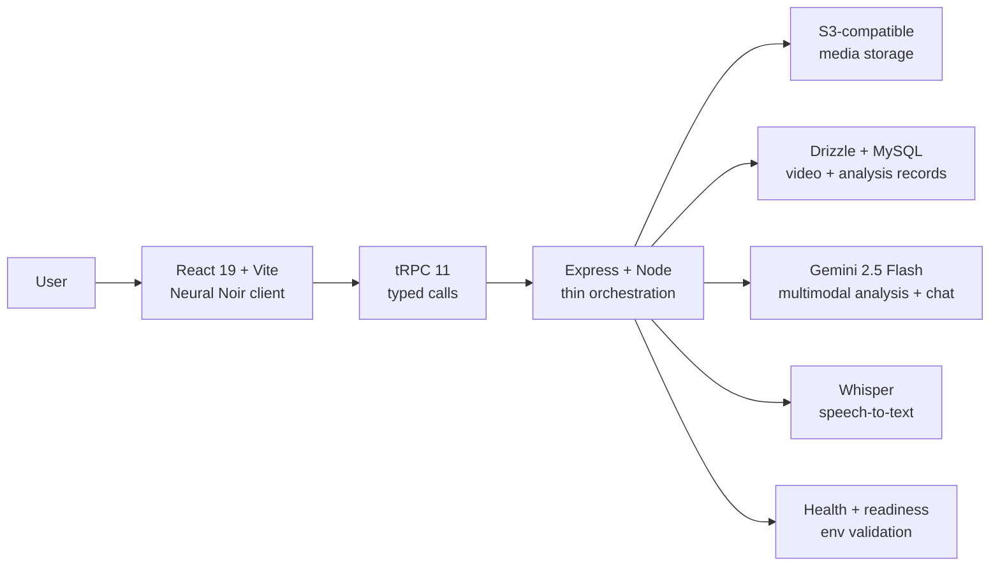
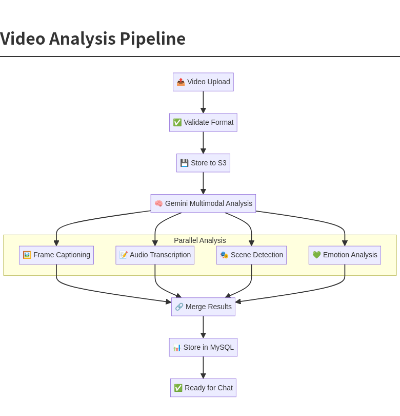

<p align="center">
  
</p>

<h1 align="center">Ellie AI</h1>

<p align="center">
  <strong>The State-of-the-Art AI Video Analysis Agent</strong>
</p>

<p align="center">
  Upload any video, ask anything. Gemini 2.5 Flash + Whisper + React 19 + tRPC 11. Neural Noir design.
</p>

<p align="center">
  <a href="#why-ellie">Why Ellie</a> ·
  <a href="#capabilities">Capabilities</a> ·
  <a href="#architecture">Architecture</a> ·
  <a href="#stack">Stack</a> ·
  <a href="#run-locally">Run Locally</a> ·
  <a href="#operations">Operations</a>
</p>

<p align="center">
  <a href="https://www.typescriptlang.org/"></a>
  <a href="https://react.dev/"></a>
  <a href="https://vite.dev/"></a>
  <a href="https://trpc.io/"></a>
  <a href="https://orm.drizzle.team/"></a>
  <a href="LICENSE"></a>
</p>

---

<p align="center">
  
</p>

## Why Ellie

Ellie is a video intelligence agent for people who need to understand media without scrubbing timelines by hand. Upload a video, let Gemini 2.5 Flash produce timestamped structure, then ask natural-language questions over the generated context. The experience is deliberately **Neural Noir**: dark, cinematic, fast, and agentic without hiding the engineering underneath.

| Product Box             | What It Does                                                               | Current Implementation                                                  |
| ----------------------- | -------------------------------------------------------------------------- | ----------------------------------------------------------------------- |
| **Video Intelligence**  | Converts media into summaries, scenes, frames, audio events, and emotions. | `analysis.analyze` calls Gemini 2.5 Flash through the LLM gateway.      |
| **Ask Anything Chat**   | Answers questions against video analysis with timestamp-aware responses.   | `chat.send` uses browser-held history plus persisted analysis context.  |
| **Voice Input**         | Turns recorded audio into text before it enters the assistant surface.     | `voice.transcribe` calls Whisper-compatible speech-to-text.             |
| **Typed Product Core**  | Keeps client and server contracts aligned as the agent surface evolves.    | React 19 consumes an Express/tRPC 11 backend with shared TypeScript.    |
| **Deployment Baseline** | Ships with validation scripts, Docker packaging, and health probes.        | `pnpm ci`, `Dockerfile`, `/api/health`, `/api/readiness`, `/api/ready`. |

## Capabilities

Ellie’s README is product-forward, but the repository is not a mockup. The core routes implement upload, multimodal analysis, chat, transcription, session helpers, and operational readiness endpoints.

| Surface              | Route or Module    | Limits and Behavior                                                               |
| -------------------- | ------------------ | --------------------------------------------------------------------------------- |
| **Upload**           | `video.upload`     | Accepts MP4, WebM, MOV, and AVI as base64 payloads up to **100 MB**.              |
| **Analyze**          | `analysis.analyze` | Produces structured JSON results with type, timestamp, content, and confidence.   |
| **Retrieve Results** | `analysis.results` | Reads persisted analysis rows for a video from the Drizzle/MySQL data layer.      |
| **Chat**             | `chat.send`        | Answers against stored analysis context with ephemeral browser-side chat history. |
| **Transcribe**       | `voice.transcribe` | Accepts WebM, MP3, WAV, OGG, M4A, and MPEG audio up to **16 MB** via Whisper.     |
| **System**           | `system.*`         | Exposes health and readiness signals for smoke tests and deployment probes.       |

<p align="center">
  
</p>

## Architecture

Ellie currently uses a **heavy-client, thin-orchestration backend** model. The browser owns the immediate product feel and ephemeral conversation memory. The backend owns the safe boundary for uploads, storage, provider calls, persistence, rate limits, and readiness checks. This keeps the agent surface responsive while preserving a clean path to queue workers, durable conversations, and multi-tenant orchestration later.


```mermaid
graph LR
    User["User"] --> Client["React 19 + Vite\nNeural Noir client"]
    Client --> TRPC["tRPC 11\ntyped calls"]
    TRPC --> Express["Express + Node\nthin orchestration"]
    Express --> Storage["S3-compatible\nmedia storage"]
    Express --> DB["Drizzle + MySQL\nvideo + analysis records"]
    Express --> Gemini["Gemini 2.5 Flash\nmultimodal analysis + chat"]
    Express --> Whisper["Whisper\nspeech-to-text"]
    Express --> Ops["Health + readiness\nenv validation"]
```

| Boundary               | Responsibility                                                     | Why It Exists                                                                      |
| ---------------------- | ------------------------------------------------------------------ | ---------------------------------------------------------------------------------- |
| **Client Agent UI**    | Upload flow, video workspace, chat state, visual feedback.         | Preserves speed and keeps short-lived interaction state near the user.             |
| **tRPC Contract**      | Typed procedure calls between browser and server.                  | Reduces drift between frontend assumptions and backend behavior.                   |
| **Express Runtime**    | Provider calls, storage writes, DB updates, rate limits, sessions. | Keeps secrets and operational state out of the browser.                            |
| **Data Plane**         | Users, videos, analysis results, conversations, and messages.      | Gives the product durable entities without overbuilding the first agent milestone. |
| **Provider Gateway**   | Gemini 2.5 Flash chat/completions and Whisper transcription.       | Centralizes AI access behind environment-managed credentials.                      |
| **Operations Surface** | Health, readiness, production validation, Docker packaging.        | Makes the repository deployable and reviewable by maintainers.                     |

<p align="center">
  
</p>

## Stack

Ellie is TypeScript across the product boundary. The stack is modern, but intentionally familiar: React and Vite for the browser, Express and tRPC for the API, Drizzle and MySQL for persistence, and Forge-compatible provider helpers for Gemini and Whisper.

| Layer                 | Technology                               | Version or Track                |
| --------------------- | ---------------------------------------- | ------------------------------- |
| **Language**          | TypeScript                               | `5.9.3`                         |
| **Frontend**          | React, React DOM, Vite                   | `19.2.x`, `7.x`                 |
| **Design System**     | Tailwind CSS, Radix UI, framer-motion    | `4.x`, Radix primitives, `12.x` |
| **Routing + Data**    | wouter, TanStack Query, tRPC React Query | `3.x`, `5.x`, `11.6.x`          |
| **Backend Runtime**   | Node.js, Express                         | Express `4.21.x`                |
| **API Contract**      | tRPC server/client                       | `11.6.x`                        |
| **Database**          | Drizzle ORM, mysql2                      | `0.44.x`, `3.15.x`              |
| **Validation**        | Zod                                      | `4.1.x`                         |
| **AI + Voice**        | Gemini 2.5 Flash, Whisper-compatible STT | Provider-gateway configured     |
| **Testing + Quality** | Vitest, Prettier, TypeScript compiler    | `2.1.x`, `3.6.x`, `5.9.3`       |
| **Packaging**         | Docker, Docker Compose                   | Repository-defined              |
| **Package Manager**   | pnpm                                     | `10.15.1`                       |

## Run Locally

The default path is a single pnpm workflow from the repository root. Configure environment values first, install with the lockfile, then run the TypeScript server in development mode.

```bash
gh repo clone Alexi5000/Ellie
cd Ellie
pnpm install --frozen-lockfile
cp .env.example .env
pnpm validate:env
pnpm dev
```

| Command                        | Purpose                                                |
| ------------------------------ | ------------------------------------------------------ |
| `pnpm dev`                     | Starts the development server with TypeScript watch.   |
| `pnpm check`                   | Runs the TypeScript no-emit gate.                      |
| `pnpm test`                    | Runs the Vitest suite.                                 |
| `pnpm build`                   | Builds the Vite client and bundles the server runtime. |
| `pnpm validate:env`            | Checks required local environment configuration.       |
| `pnpm validate:env:production` | Checks production-only environment requirements.       |
| `pnpm ci`                      | Runs the repository validation sequence.               |
| `pnpm start`                   | Runs the built production server from `dist/`.         |

## Environment

Ellie keeps secrets server-side. The browser calls typed routes; the backend talks to storage, the database, Gemini, and Whisper through environment-managed credentials.

| Variable                 | Required For                        | Notes                                                  |
| ------------------------ | ----------------------------------- | ------------------------------------------------------ |
| `DATABASE_URL`           | Drizzle/MySQL persistence           | MySQL-compatible connection string.                    |
| `JWT_SECRET`             | Session and token signing           | Must be strong in production.                          |
| `BUILT_IN_FORGE_API_URL` | Gemini and Whisper provider gateway | Base URL for chat/completions and audio transcription. |
| `BUILT_IN_FORGE_API_KEY` | Gemini and Whisper provider gateway | Server-side bearer credential.                         |
| `AWS_ACCESS_KEY_ID`      | Optional S3-compatible storage      | Used when object storage credentials are required.     |
| `AWS_SECRET_ACCESS_KEY`  | Optional S3-compatible storage      | Used with the storage helper.                          |
| `AWS_REGION`             | Optional S3-compatible storage      | Region for the configured bucket.                      |
| `S3_BUCKET_NAME`         | Optional S3-compatible storage      | Target bucket for uploaded media and audio artifacts.  |

## Repository Map

The repository is small enough to navigate directly and structured enough to survive production hardening. The important split is simple: `client/` is the experience, `server/` is the orchestration boundary, `shared/` is the contract surface, and `drizzle/` is the data plane.

| Path                | Box                          | What Lives There                                                       |
| ------------------- | ---------------------------- | ---------------------------------------------------------------------- |
| `client/`           | **Neural Noir Surface**      | React pages, UI components, routes, motion, and browser-side state.    |
| `server/`           | **Agent Runtime**            | Express server, tRPC router, LLM calls, voice transcription, storage.  |
| `server/routers.ts` | **Product API**              | Upload, analyze, chat, transcribe, auth, and system procedures.        |
| `drizzle/`          | **Relational Memory**        | Schema, migrations, and MySQL-compatible product entities.             |
| `shared/`           | **Cross-Boundary Contracts** | Shared constants and typed primitives.                                 |
| `scripts/`          | **Release Gates**            | Environment validation and automation helpers.                         |
| `docs/`             | **Operator Manual**          | Production readiness, CI/CD, testing, deployment, and standards notes. |
| `docs/templates/`   | **Portfolio System**         | Reusable README template for the rest of the portfolio.                |

## Operations

Ellie is prepared for deployment review, not just local screenshots. The repository includes a root Dockerfile, Compose file, CI-compatible scripts, environment validation, and liveness/readiness endpoints. Some GitHub workflow checks depend on repository-level secrets and permissions, so local validation remains the authoritative green gate until those secrets are configured.

| Gate                | Command or Endpoint                      | Expected Signal                                     |
| ------------------- | ---------------------------------------- | --------------------------------------------------- |
| **Install**         | `pnpm install --frozen-lockfile`         | Lockfile-consistent dependency graph.               |
| **Environment**     | `pnpm validate:env`                      | Required local variables are accounted for.         |
| **Production Env**  | `pnpm validate:env:production`           | Production-only variables are accounted for.        |
| **Types**           | `pnpm check`                             | TypeScript passes without emitting files.           |
| **Tests**           | `pnpm test`                              | Vitest suite completes.                             |
| **Build**           | `pnpm build`                             | Vite client and server bundle are generated.        |
| **Full Local Gate** | `pnpm ci`                                | Environment, types, tests, and build pass together. |
| **Health**          | `GET /api/health`                        | Runtime liveness response.                          |
| **Readiness**       | `GET /api/readiness` or `GET /api/ready` | Dependency-aware deployment probe.                  |

## Product Roadmap

Ellie’s current shape is intentionally lean: strong browser experience, typed backend orchestration, persisted analysis, and real provider calls. The next step is deeper production orchestration.

| Track                      | Next Upgrade                                                           |
| -------------------------- | ---------------------------------------------------------------------- |
| **Durable Conversations**  | Persist chat threads and add source-linked answer citations.           |
| **Processing Queue**       | Move long-running video analysis into workers with retry telemetry.    |
| **Signed Uploads**         | Replace base64 upload flow with direct-to-storage signed URLs.         |
| **Provider Observability** | Track model, prompt version, latency, token usage, and failure mode.   |
| **Tenant Readiness**       | Add organizations, roles, audit logs, and retention policies.          |
| **Evaluation Harness**     | Add golden-video tests for scene, transcript, frame, and chat quality. |

## Documentation

The root README is the front door. The rest of the documentation exists for maintainers who need setup, release, deployment, and testing detail without bloating the product narrative.

| Document                                                                           | Use It For                                            |
| ---------------------------------------------------------------------------------- | ----------------------------------------------------- |
| [`SETUP.md`](SETUP.md)                                                             | Local setup, Docker, environment, and runtime notes.  |
| [`docs/PRODUCTION_READINESS.md`](docs/PRODUCTION_READINESS.md)                     | Release gates, operational status, and risk register. |
| [`docs/README.md`](docs/README.md)                                                 | Documentation hub and source-of-truth map.            |
| [`RELEASES.md`](RELEASES.md)                                                       | Version history and milestone plan.                   |
| [`CONTRIBUTING.md`](CONTRIBUTING.md)                                               | Contribution and review expectations.                 |
| [`docs/templates/SAAS_README_TEMPLATE.md`](docs/templates/SAAS_README_TEMPLATE.md) | Reusable portfolio README standard.                   |

## License

Ellie AI is released under the [MIT License](LICENSE).

## References

[1]: https://www.typescriptlang.org/ "TypeScript"
[2]: https://react.dev/ "React"
[3]: https://vite.dev/ "Vite"
[4]: https://trpc.io/ "tRPC"
[5]: https://orm.drizzle.team/ "Drizzle ORM"
[6]: https://expressjs.com/ "Express"
[7]: https://vitest.dev/ "Vitest"
[8]: https://prettier.io/ "Prettier"
