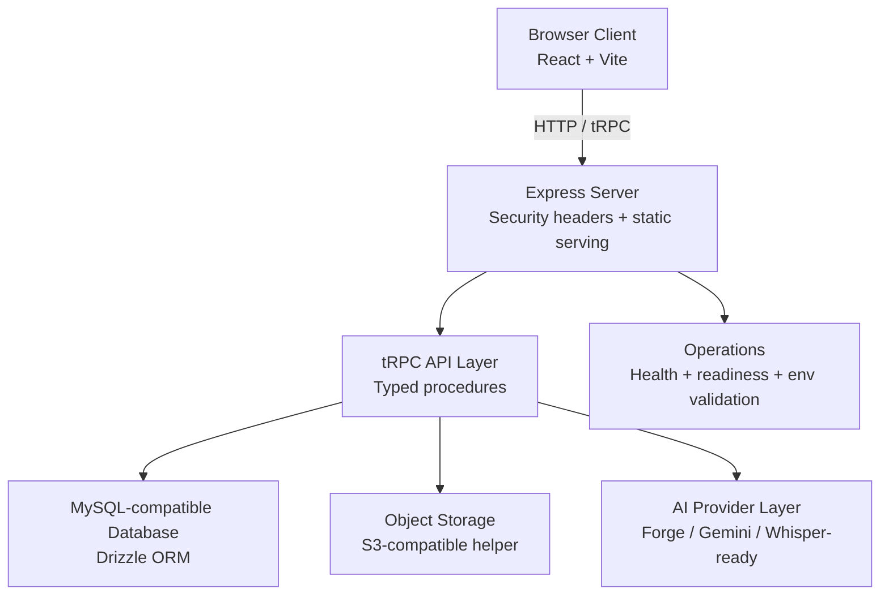

<div align="center">


# Ellie AI

### Production-shaped multimodal video intelligence for teams that need searchable, conversational media analysis.

**Ellie is a full-stack React, Express, tRPC, and Drizzle application that turns uploaded video into structured analysis records, searchable timelines, and conversational context.**

[](https://www.typescriptlang.org/)
[](https://react.dev/)
[](https://vite.dev/)
[](https://expressjs.com/)
[](https://trpc.io/)
[](https://orm.drizzle.team/)
[](LICENSE)

[About](#about-ellie) · [Backend](#backend-architecture) · [Quick Start](#quick-start) · [Operations](#operations-and-readiness) · [Documentation](#documentation) · [Release Status](#release-status)

</div>

---


## About Ellie

Ellie is designed to move beyond a visual prototype and into a professional application. The frontend presents a cinematic video-intelligence workspace, while the backend provides typed API boundaries, persistent database models, environment validation, and operational readiness endpoints. The result is a repository that can be built, reviewed, deployed, and extended with confidence rather than treated as a one-off demo.

> Ellie’s product promise is simple: upload a video, preserve its metadata, analyze its content, and make the resulting context available to a conversational AI workspace.

The current implementation is best understood as a **production-shaped release candidate**. It includes the application shell, tRPC router structure, Drizzle schema, storage integration hooks, health/readiness endpoints, Docker packaging, and a documentation set that identifies the next engineering milestones. Provider-backed AI execution, authenticated production tenancy, background processing, and end-to-end media pipeline tests remain the next backend expansion layer.

| Area | Current State | Production Direction |
|---|---|---|
| Product surface | React landing page, analysis workspace, and new `/about` application brief | Add authenticated workspace navigation, usage states, and organization-level settings. |
| Backend | Express server, tRPC router, database helper, storage helper, health, and readiness endpoints | Add queue-backed processing, provider adapters, integration tests, and observability exporters. |
| Persistence | Drizzle schema for users, videos, analysis records, conversations, and messages | Add migrations for tenant ownership, processing jobs, audit events, and provider execution logs. |
| Operations | Environment validator, Dockerfile, `.dockerignore`, `/api/health`, and `/api/readiness` | Add hosted monitoring, alerts, rate limiting, and deployment-specific secrets rotation. |
| Documentation | README, setup guide, production-readiness guide, release history, and contribution hygiene | Keep release notes and architecture docs current with every backend milestone. |

## Product Capabilities

Ellie’s application model combines a visual video workspace with a typed backend that can evolve into a production media-intelligence platform. React provides the UI composition model, Vite provides the frontend build pipeline, Express hosts the server runtime, tRPC connects the client and server through type-safe procedures, and Drizzle maps the relational data model into TypeScript.[1] [2] [3] [4] [5]

| Capability | User Value | Backend Responsibility |
|---|---|---|
| Video intake | Users can introduce video assets into a guided analysis workspace. | Validate metadata, persist video records, and hand off media to object storage. |
| Multimodal analysis | Users receive structured summaries, timestamps, and conversational context. | Store AI-generated analysis records and expose them through typed procedures. |
| Conversation memory | Users can ask follow-up questions with video context preserved. | Persist conversations and messages against users and videos. |
| Operational health | Maintainers can determine whether the service is alive and deploy-ready. | Expose health/readiness endpoints and validate required production configuration. |
| Release confidence | Contributors can run repeatable local checks before shipping. | Provide `pnpm validate:env`, `pnpm check`, `pnpm test`, `pnpm build`, and `pnpm ci`. |

## Screenshot

<div align="center">

</div>

## Backend Architecture

The hardened backend is intentionally TypeScript-first. It keeps a single language across the frontend, server, validation scripts, router contracts, and database access layer, which reduces schema drift and makes the repository easier to evolve during the next full-stack expansion.


```mermaid
graph TB
    Browser["Browser Client\nReact + Vite"]
    Express["Express Server\nSecurity headers + static serving"]
    TRPC["tRPC API Layer\nTyped procedures"]
    DB["MySQL-compatible Database\nDrizzle ORM"]
    Storage["Object Storage\nS3-compatible helper"]
    AI["AI Provider Layer\nForge / Gemini / Whisper-ready"]
    Ops["Operations\nHealth + readiness + env validation"]

    Browser -->|HTTP / tRPC| Express
    Express --> TRPC
    TRPC --> DB
    TRPC --> Storage
    TRPC --> AI
    Express --> Ops
```

| Backend Component | Path | Purpose |
|---|---|---|
| Server entrypoint | `server/_core/index.ts` | Hosts Express, applies baseline security headers, mounts tRPC, serves static assets, and exposes health/readiness endpoints. |
| Environment model | `server/_core/env.ts` | Parses environment variables, classifies required production settings, and exposes safe status metadata without leaking secrets. |
| API router | `server/routers.ts` | Defines the typed tRPC surface for application operations. |
| Database helper | `server/db.ts` | Creates the Drizzle/MySQL connection and exposes a readiness check for dependency probes. |
| Schema | `drizzle/schema.ts` | Defines users, videos, analysis results, conversations, and messages. |
| Storage helper | `server/storage.ts` | Provides object-storage integration points for uploaded media and generated artifacts. |
| Env validator | `scripts/validate-env.ts` | Runs safe local and CI validation of required configuration inventory. |

## API and Operations Surface

Ellie now exposes explicit operational endpoints that deployment platforms and reviewers can inspect before routing traffic to the application. The health endpoint is intentionally lightweight, while readiness performs configuration and dependency-oriented checks appropriate for release gates.

| Endpoint | Method | Purpose | Expected Use |
|---|---|---|---|
| `/api/health` | `GET` | Confirms the HTTP process is alive and identifies the service, version, and environment mode. | Container and platform liveness checks. |
| `/api/readiness` | `GET` | Reports whether required production configuration and database readiness checks pass. | Pre-release and rollout readiness checks. |
| `/api/trpc/*` | `GET` / `POST` | Hosts the typed application API surface. | Frontend application calls through the tRPC client. |

The server also applies a baseline set of production security headers. These include content type sniffing protection, frame protection, referrer policy, and a restrictive permissions policy. This is a baseline rather than a substitute for a complete production security program, which should also include hosted HTTPS, secret rotation, dependency scanning, rate limits, and audit logging.

## Data Model

Ellie’s current schema captures the durable product entities required for a video-intelligence workspace. The schema is intentionally compact and can be expanded with jobs, tenants, billing, and provider execution records as the product hardens.

| Entity | Purpose | Important Relationships |
|---|---|---|
| `users` | Stores identity and profile metadata. | Owns videos and conversations. |
| `videos` | Stores uploaded media metadata, storage keys, and processing status. | Belongs to a user and owns analysis records. |
| `analysis_results` | Stores timestamped multimodal outputs and confidence metadata. | Belongs to a video. |
| `conversations` | Stores per-video conversational threads. | Belongs to a user and video. |
| `messages` | Stores user and assistant messages with optional metadata. | Belongs to a conversation. |

## Quick Start

The repository uses a single pnpm-managed TypeScript workspace. The declared package manager is pinned in `package.json`, and the build produces a Vite frontend plus a bundled Node server.

### Prerequisites

| Tool | Required Version | Notes |
|---|---:|---|
| Node.js | 22 or newer | Matches the server runtime targeted by the Dockerfile. |
| pnpm | 10.x | The package manager is declared in `package.json`. |
| MySQL-compatible database | 8.x compatible | Required for production readiness and Drizzle migrations. |
| S3-compatible object storage | Provider-specific | Required for real media upload workflows. |

### Local Setup

```bash
git clone https://github.com/Alexi5000/Ellie.git
cd Ellie
pnpm install --frozen-lockfile
cp .env.example .env
pnpm validate:env
pnpm dev
```

The development server starts the Express runtime with Vite middleware. In local development, missing production-only secrets are reported by the environment validator but do not prevent the app from starting.

### Production Build

```bash
pnpm validate:env:production
pnpm check
pnpm test
pnpm build
NODE_ENV=production pnpm start
```

A production environment must provide `DATABASE_URL`, `JWT_SECRET`, `BUILT_IN_FORGE_API_URL`, and `BUILT_IN_FORGE_API_KEY`. The validator prints only status labels, never secret values.

## Configuration

The `.env.example` file is the source of truth for expected configuration. Production secrets should be managed by the deployment platform or a dedicated secret manager, not committed to the repository.

| Variable | Required in Production | Purpose |
|---|---:|---|
| `DATABASE_URL` | Yes | MySQL-compatible connection string used by Drizzle. |
| `JWT_SECRET` | Yes | Session and token signing secret. |
| `BUILT_IN_FORGE_API_URL` | Yes | AI/provider gateway endpoint. |
| `BUILT_IN_FORGE_API_KEY` | Yes | AI/provider gateway credential. |
| `VITE_APP_ID` | No | Optional public app identifier. |
| `VITE_APP_TITLE` | No | Optional public app title. |
| `OAUTH_SERVER_URL` | No | Optional OAuth provider URL for authenticated deployments. |
| `OWNER_OPEN_ID` | No | Optional initial owner identity. |
| `PORT` | No | HTTP port, defaulting to `5000` where supported. |

## Available Scripts

| Command | Purpose |
|---|---|
| `pnpm dev` | Start the development server with Vite middleware and backend hot reload. |
| `pnpm validate:env` | Print safe configuration inventory for the current environment. |
| `pnpm validate:env:production` | Fail if production-required variables are missing. |
| `pnpm check` | Run TypeScript typechecking without emitting files. |
| `pnpm test` | Run the Vitest suite. |
| `pnpm build` | Build the Vite frontend and bundled Node server. |
| `pnpm start` | Start the built production server. |
| `pnpm ci` | Run environment validation, typecheck, tests, and build as one release gate. |
| `pnpm db:generate` | Generate Drizzle migrations. |
| `pnpm db:migrate` | Apply Drizzle migrations. |
| `pnpm db:push` | Generate and apply migrations through the project script. |

## Docker

Ellie includes a production Dockerfile and `.dockerignore`. The image installs dependencies with pnpm, builds the frontend and server, and starts the bundled production runtime.

```bash
docker build -t ellie-ai:local .
docker run --rm -p 5000:5000 --env-file .env ellie-ai:local
curl http://localhost:5000/api/health
curl http://localhost:5000/api/readiness
```

The Docker healthcheck targets `/api/health`. Readiness remains separate because it reflects configuration and dependency state, which may legitimately fail in development or preview environments that do not provide production secrets.

## Operations and Readiness

A release should not be promoted unless the repeatable gates below pass in the target environment. The same gates are documented in `docs/PRODUCTION_READINESS.md` for reviewers and release owners.

| Gate | Command or Check | Required Before Production |
|---|---|---:|
| Dependency installation | `pnpm install --frozen-lockfile` | Yes |
| Environment inventory | `pnpm validate:env:production` | Yes |
| Type safety | `pnpm check` | Yes |
| Unit tests | `pnpm test` | Yes |
| Production build | `pnpm build` | Yes |
| Runtime liveness | `curl /api/health` | Yes |
| Runtime readiness | `curl /api/readiness` | Yes |
| Database migration review | `pnpm db:generate` and migration diff review | Yes when schema changes. |

## Repository Structure

```text
Ellie/
├── client/                 # React, Vite, Tailwind, and application pages
├── server/                 # Express runtime, tRPC routers, env, DB, and storage helpers
├── shared/                 # Shared TypeScript contracts and schemas
├── drizzle/                # Drizzle schema definitions
├── scripts/                # Repository automation and validation scripts
├── docs/                   # Engineering, deployment, testing, and readiness documentation
├── assets/                 # README and product imagery
├── Dockerfile              # Production container definition
├── .dockerignore           # Container build exclusion rules
└── package.json            # Scripts, dependencies, version, and package-manager metadata
```

## Documentation

| Document | Purpose |
|---|---|
| [`SETUP.md`](SETUP.md) | Local setup, production build, environment validation, Docker, and health-check instructions. |
| [`docs/PRODUCTION_READINESS.md`](docs/PRODUCTION_READINESS.md) | Release gates, backend status, operational endpoints, and hardening roadmap. |
| [`RELEASES.md`](RELEASES.md) | Version history and planned production milestones. |
| [`CONTRIBUTING.md`](CONTRIBUTING.md) | Branching, validation, documentation, and review expectations. |
| [`docs/README.md`](docs/README.md) | Documentation index for repository maintainers. |
| [`docs/migration/backend-fastapi-reference/`](docs/migration/backend-fastapi-reference/) | Reference-only FastAPI migration notes from earlier exploration. The active backend is TypeScript/Express. |

## Release Status

The current hardened version is **1.1.0**, which establishes the production-readiness baseline. It does not claim that every AI-provider workflow is complete; instead, it makes the repository honest, operable, documented, and ready for the next backend implementation increment.

| Version | Status | Summary |
|---|---|---|
| `1.1.0` | Release candidate | Adds environment readiness metadata, health/readiness endpoints, Docker packaging, production documentation, and an application about page. |
| `1.2.0` | Planned | Add authenticated owner/user flows, job records, queue-backed video analysis, and provider adapter tests. |
| `2.0.0` | Planned | Add multi-tenant production workflows, observability, hosted deployment recipes, and end-to-end media-processing guarantees. |

## Roadmap

The next engineering work should prioritize backend depth over additional visual polish. The highest-value production tasks are queue-backed processing, provider adapter boundaries, integration tests, authenticated tenancy, audit logging, and deployment monitoring.

| Priority | Workstream | Outcome |
|---:|---|---|
| 1 | Provider adapters | Gemini, Whisper, and storage calls become testable interfaces rather than implicit integration assumptions. |
| 2 | Processing jobs | Video analysis moves from synchronous request handling into durable background jobs. |
| 3 | Authentication | User ownership, session enforcement, and protected procedures become mandatory for private media. |
| 4 | Observability | Structured logs, metrics, traces, and alerts make production behavior measurable. |
| 5 | Integration tests | Router, database, storage, and readiness checks are covered by repeatable tests. |

## License

Ellie is released under the [MIT License](LICENSE).

## References

[1]: https://react.dev/ "React documentation"
[2]: https://vite.dev/guide/ "Vite guide"
[3]: https://expressjs.com/ "Express documentation"
[4]: https://trpc.io/docs "tRPC documentation"
[5]: https://orm.drizzle.team/docs/overview "Drizzle ORM documentation"
