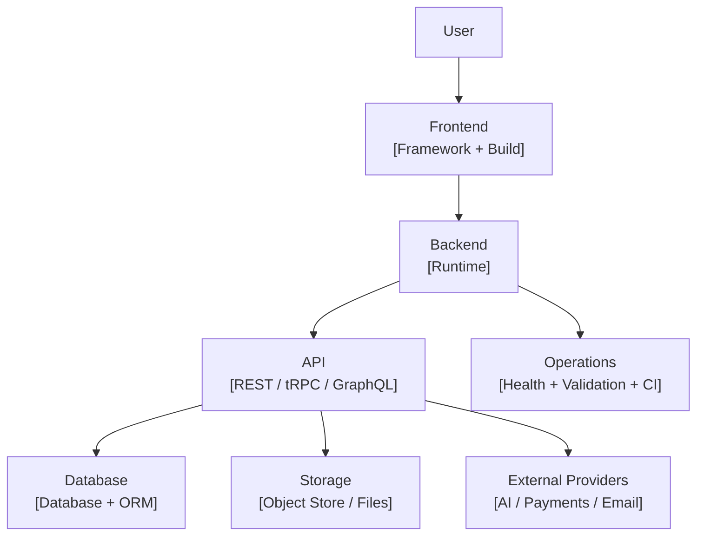

# SaaS README Template

> Copy this file to a repository root as `README.md`, replace every bracketed placeholder, and delete template guidance notes before publishing. The template is designed for production SaaS repositories that need a premium product-facing and engineering-facing presentation.

<p align="center">
  
</p>

<h1 align="center">[Product Name]</h1>

<p align="center">
  <strong>[One-line product promise written like a real SaaS platform, not a code sample.]</strong>
</p>

<p align="center">
  <a href="#platform-overview">Platform</a> ·
  <a href="#product-experience">Experience</a> ·
  <a href="#architecture">Architecture</a> ·
  <a href="#stack">Stack</a> ·
  <a href="#local-development">Runbook</a> ·
  <a href="#production-readiness">Production</a>
</p>

<p align="center">
  <a href="[Technology URL]"></a>
  <a href="LICENSE"></a>
</p>

---

<p align="center">
  
</p>

## Platform Overview

> **[Product Name] is built like a SaaS platform, not a demo.** The repository contains [frontend], [backend], [API layer], [data layer], [storage layer], [validation gates], [deployment artifacts], and [documentation artifacts].

[Write two polished paragraphs explaining the product, the customer or user, the core workflow, and why the repository is structured as a complete application asset. Avoid hype that is not supported by committed code. Every strong claim should correspond to a file, command, endpoint, schema, workflow, or deployment artifact.]

| Platform Card  | Current State                                   | Production Value                                    |
| -------------- | ----------------------------------------------- | --------------------------------------------------- |
| **Product**    | [Primary product workflow.]                     | [Why this matters to users.]                        |
| **Frontend**   | [Frontend framework, build system, UI assets.]  | [Why the product surface is credible.]              |
| **Backend**    | [Runtime, API, operational endpoints.]          | [Why the service is deployable.]                    |
| **Data**       | [Schema, migrations, persistence.]              | [Why the application has durable business objects.] |
| **Operations** | [Docker, CI, validation, tests.]                | [Why the repo is repeatable.]                       |
| **Governance** | [License, docs, templates, contribution files.] | [Why the repository is maintainable.]               |

## Product Experience

[Explain the product experience in complete paragraphs. Use this section to make the repo feel like a SaaS system with a real user journey.]

| Experience Panel | What the User Sees                         | What the System Owns                             |
| ---------------- | ------------------------------------------ | ------------------------------------------------ |
| **[Workflow 1]** | [User-facing behavior.]                    | [Backend, data, or integration responsibility.]  |
| **[Workflow 2]** | [User-facing behavior.]                    | [Backend, data, or integration responsibility.]  |
| **[Workflow 3]** | [User-facing behavior.]                    | [Backend, data, or integration responsibility.]  |
| **[Operations]** | [Health, settings, status, admin surface.] | [Monitoring, readiness, jobs, or runtime state.] |

<p align="center">
  
</p>

## Architecture

[Write a concise architecture overview. State the actual architecture, not an aspirational architecture. Name the frontend, backend, API, data, storage, provider, and operations layers that exist in the repository.]



| System Boundary        | Primary Paths | Responsibility    |
| ---------------------- | ------------- | ----------------- |
| **Client Application** | `[path]`      | [Responsibility.] |
| **Server Runtime**     | `[path]`      | [Responsibility.] |
| **Shared Contracts**   | `[path]`      | [Responsibility.] |
| **Persistence**        | `[path]`      | [Responsibility.] |
| **Automation**         | `[path]`      | [Responsibility.] |
| **Knowledge Base**     | `[path]`      | [Responsibility.] |

## Stack

| Layer                | Technology           | Version or Track | Why It Is Here |
| -------------------- | -------------------- | ---------------: | -------------- |
| **Language**         | [Language]           |        [Version] | [Reason.]      |
| **Frontend Runtime** | [Framework]          |        [Version] | [Reason.]      |
| **Frontend Build**   | [Build Tool]         |        [Version] | [Reason.]      |
| **Server Runtime**   | [Runtime]            |        [Version] | [Reason.]      |
| **API Contract**     | [API Layer]          |        [Version] | [Reason.]      |
| **Database Layer**   | [Database/ORM]       |        [Version] | [Reason.]      |
| **Testing**          | [Test Tool]          |        [Version] | [Reason.]      |
| **Packaging**        | [Docker/Deploy Tool] |        [Version] | [Reason.]      |

## SaaS Capability Map

| Capability         | Implemented Foundation         | Next Production Extension             |
| ------------------ | ------------------------------ | ------------------------------------- |
| **Authentication** | [Current auth state.]          | [Next auth work.]                     |
| **Core Workflow**  | [Current product capability.]  | [Next production capability.]         |
| **Data**           | [Schema/model state.]          | [Migration, backups, tenancy.]        |
| **Storage**        | [Storage state.]               | [Lifecycle, scanning, signed URLs.]   |
| **Operations**     | [Health, readiness, jobs, CI.] | [Metrics, logs, alerts.]              |
| **Governance**     | [Docs, license, policies.]     | [Security policy, code owners, ADRs.] |

## Repository Map

| Path     | Box                    | What Belongs There |
| -------- | ---------------------- | ------------------ |
| `[path]` | **Product Surface**    | [Description.]     |
| `[path]` | **Application Core**   | [Description.]     |
| `[path]` | **Data Plane**         | [Description.]     |
| `[path]` | **Automation**         | [Description.]     |
| `[path]` | **Operator Knowledge** | [Description.]     |

## Local Development

```bash
git clone [repository-url]
cd [repository-name]
[package-manager] install --frozen-lockfile
cp .env.example .env
[package-manager] validate:env
[package-manager] dev
```

| Requirement           | Expected Baseline | Notes     |
| --------------------- | ----------------: | --------- |
| **Runtime**           |         [Version] | [Reason.] |
| **Package Manager**   |         [Version] | [Reason.] |
| **Database**          |        [Provider] | [Reason.] |
| **Storage**           |        [Provider] | [Reason.] |
| **External Services** |       [Providers] | [Reason.] |

## Environment Model

| Variable     | Required for Production | Purpose    |
| ------------ | ----------------------: | ---------- |
| `[VARIABLE]` |                     Yes | [Purpose.] |
| `[VARIABLE]` |                      No | [Purpose.] |

## Commands

| Command     | Box                        | What It Proves                 |
| ----------- | -------------------------- | ------------------------------ |
| `[command]` | **Developer Loop**         | [What it starts.]              |
| `[command]` | **Release Build**          | [What it builds.]              |
| `[command]` | **Type Gate**              | [What it checks.]              |
| `[command]` | **Test Gate**              | [What it tests.]               |
| `[command]` | **Formatting Gate**        | [What it formats or verifies.] |
| `[command]` | **Production Config Gate** | [What it validates.]           |

## Production Readiness

[Explain clearly what is already committed and what must be supplied by deployment infrastructure. Do not pretend a repository includes managed infrastructure unless it actually does.]

| Readiness Area        | Repository Status | Deployment Owner Action |
| --------------------- | ----------------- | ----------------------- |
| **Application Build** | [Status.]         | [Action.]               |
| **Type Safety**       | [Status.]         | [Action.]               |
| **Tests**             | [Status.]         | [Action.]               |
| **Configuration**     | [Status.]         | [Action.]               |
| **Database**          | [Status.]         | [Action.]               |
| **Storage**           | [Status.]         | [Action.]               |
| **Security**          | [Status.]         | [Action.]               |
| **Observability**     | [Status.]         | [Action.]               |

## Deployment Path

```bash
[install command]
[production env validation command]
[typecheck command]
[test command]
[build command]
[start command]
```

| Deployment Step | Description    | Success Signal |
| --------------- | -------------- | -------------- |
| **Install**     | [Description.] | [Signal.]      |
| **Configure**   | [Description.] | [Signal.]      |
| **Verify**      | [Description.] | [Signal.]      |
| **Migrate**     | [Description.] | [Signal.]      |
| **Release**     | [Description.] | [Signal.]      |
| **Observe**     | [Description.] | [Signal.]      |

## API and Operations Surface

| Endpoint     | Method     | Box        | Expected Use |
| ------------ | ---------- | ---------- | ------------ |
| `[endpoint]` | `[method]` | **[Role]** | [Use.]       |

## Data Model

| Entity     | Box                   | Purpose    |
| ---------- | --------------------- | ---------- |
| `[entity]` | **[Business Object]** | [Purpose.] |

## Security and Compliance Posture

[State the real security baseline. Separate repository-level controls from production infrastructure controls.]

| Control Area         | Repository Foundation | Recommended Production Layer |
| -------------------- | --------------------- | ---------------------------- |
| **Secrets**          | [Current state.]      | [Next layer.]                |
| **Transport**        | [Current state.]      | [Next layer.]                |
| **Access**           | [Current state.]      | [Next layer.]                |
| **Abuse Protection** | [Current state.]      | [Next layer.]                |
| **Supply Chain**     | [Current state.]      | [Next layer.]                |
| **Observability**    | [Current state.]      | [Next layer.]                |

## Documentation System

| Document      | Purpose    |
| ------------- | ---------- |
| `README.md`   | [Purpose.] |
| `[docs/path]` | [Purpose.] |

## Roadmap

| Horizon   | Workstream        | Outcome    |
| --------- | ----------------- | ---------- |
| **Now**   | [Current work.]   | [Outcome.] |
| **Next**  | [Near-term work.] | [Outcome.] |
| **Later** | [Long-term work.] | [Outcome.] |

## License

[Product Name] is released under the [License Name](LICENSE).
