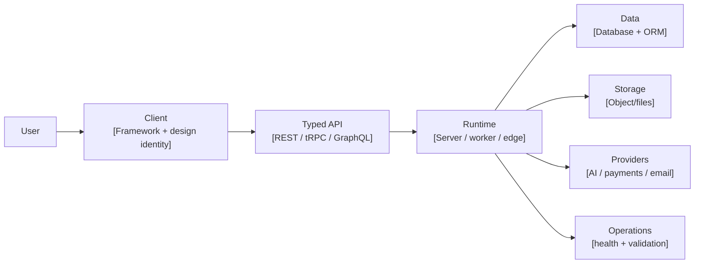

# Elite SaaS README Template

> Copy this file to a repository root as `README.md`, replace every bracketed placeholder, and delete this note before publishing. The standard is product-first, implementation-honest, visually boxed, and concise enough to feel like a top open-source repository rather than a corporate document.

<p align="center">
  
</p>

<h1 align="center">[Product Name]</h1>

<p align="center">
  <strong>[Sharp category claim: The state-of-the-art ___ for ___.]</strong>
</p>

<p align="center">
  [One sentence tagline. Name the hero workflow and the flagship stack: Model/API + runtime + typed contract + design identity.]
</p>

<p align="center">
  <a href="#why-[slug]">Why [Product]</a> ·
  <a href="#capabilities">Capabilities</a> ·
  <a href="#architecture">Architecture</a> ·
  <a href="#stack">Stack</a> ·
  <a href="#run-locally">Run Locally</a> ·
  <a href="#operations">Operations</a>
</p>

<p align="center">
  <a href="[Technology URL]"></a>
  <a href="LICENSE"></a>
</p>

---

<p align="center">
  
</p>

## Why [Product]

[Write one strong paragraph that explains what the product does, who it is for, and why the experience feels distinct. Avoid generic SaaS phrasing. If you name a model, provider, workflow, or architecture choice, make sure the repository actually implements it.]

| Product Box       | What It Does                         | Current Implementation                         |
| ----------------- | ------------------------------------ | ---------------------------------------------- |
| **[Workflow 1]**  | [User-facing value.]                 | [Actual route, module, job, or component.]     |
| **[Workflow 2]**  | [User-facing value.]                 | [Actual route, module, job, or component.]     |
| **[AI / Logic]**  | [Intelligence or automation layer.]  | [Actual model, provider, adapter, or engine.]  |
| **Typed Core**    | [How the app keeps contracts clean.] | [Actual API contract, schema, or shared code.] |
| **Deployability** | [How the repo proves it can ship.]   | [Actual commands, Docker, checks, probes.]     |

## Capabilities

[Summarize the real committed capabilities in one paragraph. This section should make the repository feel alive without overstating what the code can do today.]

| Surface        | Route, Module, or Command | Limits and Behavior                                   |
| -------------- | ------------------------- | ----------------------------------------------------- |
| **[Feature]**  | `[path.or.route]`         | [Accepted inputs, constraints, state, or output.]     |
| **[Feature]**  | `[path.or.route]`         | [Accepted inputs, constraints, state, or output.]     |
| **[Feature]**  | `[path.or.route]`         | [Accepted inputs, constraints, state, or output.]     |
| **Operations** | `[endpoint or command]`   | [Health, readiness, jobs, validation, or smoke test.] |

<p align="center">
  
</p>

## Architecture

[State the actual architecture plainly. If the product is heavy-client, backend-orchestrated, queue-backed, serverless, desktop-first, mobile-first, or monolithic, say so. Explain the tradeoff in one paragraph rather than pretending the app is more distributed than it is.]



| Boundary               | Responsibility                                 | Why It Exists                                      |
| ---------------------- | ---------------------------------------------- | -------------------------------------------------- |
| **Client Surface**     | [What the browser/app owns.]                   | [Why this belongs close to the user.]              |
| **API Contract**       | [How client and backend communicate.]          | [How drift is prevented.]                          |
| **Runtime**            | [What the server, worker, or edge layer owns.] | [How secrets, orchestration, and policy are held.] |
| **Data Plane**         | [What is persisted.]                           | [Why these objects matter.]                        |
| **Provider Boundary**  | [External systems used.]                       | [Why access is centralized.]                       |
| **Operations Surface** | [Health, readiness, validation, packaging.]    | [How maintainers know it can ship.]                |

## Stack

[Write one concise paragraph that explains the stack personality. Name the technologies because top README files make the engineering taste obvious quickly.]

| Layer                 | Technology                            | Version or Track          |
| --------------------- | ------------------------------------- | ------------------------- |
| **Language**          | [Language]                            | `[version]`               |
| **Frontend**          | [Framework, build tool]               | `[version]`               |
| **Design System**     | [CSS/UI/motion stack]                 | `[version]`               |
| **Routing + Data**    | [Router, query client, API client]    | `[version]`               |
| **Backend Runtime**   | [Runtime/server]                      | `[version]`               |
| **API Contract**      | [REST/tRPC/GraphQL/OpenAPI]           | `[version]`               |
| **Database**          | [Database/ORM/driver]                 | `[version]`               |
| **Validation**        | [Schema/config validation]            | `[version]`               |
| **External Services** | [AI/payments/storage/email/providers] | [Configured provider set] |
| **Testing + Quality** | [Tests/formatter/typechecker]         | `[version]`               |
| **Packaging**         | [Docker/deployment tooling]           | [Repository-defined]      |
| **Package Manager**   | [npm/pnpm/yarn/uv/etc.]               | `[version]`               |

## Run Locally

[Explain the shortest successful local path. Keep this section operational, not philosophical.]

```bash
gh repo clone [owner/repository]
cd [repository]
[package-manager] install --frozen-lockfile
cp .env.example .env
[package-manager] validate:env
[package-manager] dev
```

| Command     | Purpose                                   |
| ----------- | ----------------------------------------- |
| `[command]` | [Starts the developer loop.]              |
| `[command]` | [Runs type checks.]                       |
| `[command]` | [Runs tests.]                             |
| `[command]` | [Builds production artifacts.]            |
| `[command]` | [Validates environment configuration.]    |
| `[command]` | [Starts the production server or worker.] |

## Environment

[State where secrets live and which layer uses them. Never imply secrets are browser-safe unless they actually are.]

| Variable     | Required For       | Notes               |
| ------------ | ------------------ | ------------------- |
| `[VARIABLE]` | [Runtime/feature.] | [What it controls.] |
| `[VARIABLE]` | [Runtime/feature.] | [What it controls.] |
| `[VARIABLE]` | [Runtime/feature.] | [What it controls.] |

## Repository Map

[Explain the repository shape in one paragraph. The reader should understand what to open first and which folders are legacy, active, generated, or operational.]

| Path      | Box                          | What Lives There                                   |
| --------- | ---------------------------- | -------------------------------------------------- |
| `[path/]` | **Product Surface**          | [UI, routes, components, app state.]               |
| `[path/]` | **Application Runtime**      | [Server, worker, jobs, integrations.]              |
| `[path/]` | **Cross-Boundary Contracts** | [Shared types, schemas, generated clients.]        |
| `[path/]` | **Data Plane**               | [Schema, migrations, seed data, persistence.]      |
| `[path/]` | **Release Gates**            | [Validation, build, test, and deployment scripts.] |
| `[path/]` | **Operator Manual**          | [Setup, readiness, deployment, testing docs.]      |

## Operations

[Be honest about green gates. Separate checks that pass locally from checks that require external secrets, paid services, protected environments, or deployment infrastructure.]

| Gate                | Command or Endpoint        | Expected Signal                         |
| ------------------- | -------------------------- | --------------------------------------- |
| **Install**         | `[install command]`        | [Lockfile-consistent dependency graph.] |
| **Environment**     | `[env validation command]` | [Required variables are accounted for.] |
| **Types**           | `[typecheck command]`      | [Type system passes.]                   |
| **Tests**           | `[test command]`           | [Test suite completes.]                 |
| **Build**           | `[build command]`          | [Production artifacts are generated.]   |
| **Full Local Gate** | `[ci command]`             | [Required local gates pass together.]   |
| **Health**          | `[health endpoint]`        | [Runtime liveness response.]            |
| **Readiness**       | `[readiness endpoint]`     | [Dependency-aware deployment signal.]   |

## Product Roadmap

[Use a tight roadmap that follows from the current architecture. Avoid vague “AI improvements”; name the next operational layers.]

| Track                  | Next Upgrade                                     |
| ---------------------- | ------------------------------------------------ |
| **[Track]**            | [Concrete next production capability.]           |
| **[Track]**            | [Concrete next production capability.]           |
| **[Track]**            | [Concrete next production capability.]           |
| **Evaluation Harness** | [How quality will be tested beyond screenshots.] |

## Documentation

[Keep the README clean by pointing maintainers to deeper docs. Only link files that exist.]

| Document            | Use It For                        |
| ------------------- | --------------------------------- |
| [`SETUP.md`]        | [Local setup and runtime notes.]  |
| [`docs/...`]        | [Production or deployment notes.] |
| [`RELEASES.md`]     | [Version history and milestones.] |
| [`CONTRIBUTING.md`] | [Contribution expectations.]      |

## License

[Product Name] is released under the [License Name](LICENSE).

## References

[1]: [Technology URL] "[Technology Name]"
